# Milvus Distributed High Availability Setup

```mermaid
graph TD
    %% Define styling for visual clarity
    classDef milvus fill:#4CAF50,color:#fff,stroke:#2E7D32;
    classDef etcd fill:#1976D2,color:#fff,stroke:#0D47A1;
    classDef minio fill:#D81B60,color:#fff,stroke:#880E4F;
    classDef monitoring fill:#FF9800,color:#fff,stroke:#EF6C00;
    classDef storage fill:#78909C,color:#fff,stroke:#455A64;
    classDef client fill:#FF5722,color:#fff,stroke:#D84315;

    %% Client interaction
    A[Client<br>REST/gRPC<br>Port: 19530, 9091] -->|Connects to| B1[Proxy 1<br>Port: 19530, 9091<br>Handles client requests]
    A -->|Connects to| B2[Proxy 2<br>Port: 19531, 9092<br>Handles client requests]
    A:::client

    %% Milvus Components
    B1 -->|Coordinates with| C[Root Coordinator<br>Manages cluster topology]
    B2 -->|Coordinates with| C
    B1 -->|Queries| D[Query Coordinator<br>Manages query nodes]
    B2 -->|Queries| D
    B1 -->|Data ops| E[Data Coordinator<br>Manages data nodes]
    B2 -->|Data ops| E
    B1 -->|Indexing| F[Index Coordinator<br>Manages index nodes]
    B2 -->|Indexing| F

    D -->|Distributes queries| G1[Query Node 1<br>Executes searches]
    D -->|Distributes queries| G2[Query Node 2<br>Executes searches]
    E -->|Manages data| H1[Data Node 1<br>Handles persistence]
    E -->|Manages data| H2[Data Node 2<br>Handles persistence]
    F -->|Builds indexes| I1[Index Node 1<br>Creates vector indexes]
    F -->|Builds indexes| I2[Index Node 2<br>Creates vector indexes]

    %% etcd Cluster
    J1[etcd 1<br>Port: 2379, 2380<br>Metadata storage] -->|Cluster sync| J2[etcd 2<br>Port: 2379, 2382<br>Metadata storage]
    J1 -->|Cluster sync| J3[etcd 3<br>Port: 2379, 2384<br>Metadata storage]
    J2 -->|Cluster sync| J3
    C -->|Stores metadata| J1
    D -->|Stores metadata| J1
    E -->|Stores metadata| J1
    F -->|Stores metadata| J1

    %% MinIO Cluster
    K1[MinIO 1<br>Port: 9000, 9001<br>Object storage] -->|Distributed storage| K2[MinIO 2<br>Port: 9002, 9003<br>Object storage]
    K1 -->|Distributed storage| K3[MinIO 3<br>Port: 9004, 9005<br>Object storage]
    K1 -->|Distributed storage| K4[MinIO 4<br>Port: 9006, 9007<br>Object storage]
    K2 -->|Distributed storage| K3
    K2 -->|Distributed storage| K4
    K3 -->|Distributed storage| K4
    H1 -->|Stores vectors| K1
    H2 -->|Stores vectors| K1
    I1 -->|Stores indexes| K1
    I2 -->|Stores indexes| K1

    %% Monitoring
    L[Prometheus<br>Port: 9090<br>Scrapes metrics] -->|Monitors| B1
    L -->|Monitors| B2
    L -->|Monitors| C
    L -->|Monitors| D
    L -->|Monitors| G1
    L -->|Monitors| G2
    L -->|Monitors| E
    L -->|Monitors| H1
    L -->|Monitors| H2
    L -->|Monitors| F
    L -->|Monitors| I1
    L -->|Monitors| I2
    L -->|Monitors| J1
    L -->|Monitors| J2
    L -->|Monitors| J3
    L -->|Monitors| K1
    L -->|Monitors| K2
    L -->|Monitors| K3
    L -->|Monitors| K4
    L -->|Monitors| M[Node Exporter<br>Port: 9100<br>Host metrics]
    N[Grafana<br>Port: 3000<br>Visualizes metrics] -->|Queries| L

    %% Persistent Volumes
    O1[(etcd1_data)] --> J1
    O2[(etcd2_data)] --> J2
    O3[(etcd3_data)] --> J3
    P1[(minio1_data)] --> K1
    P2[(minio2_data)] --> K2
    P3[(minio3_data)] --> K3
    P4[(minio4_data)] --> K4
    Q[(milvus_data)] --> C
    Q --> B1
    Q --> B2
    Q --> D
    Q --> G1
    Q --> G2
    Q --> E
    Q --> H1
    Q --> H2
    Q --> F
    Q --> I1
    Q --> I2
    R[(milvus_logs)] --> C
    R --> B1
    R --> B2
    R --> D
    R --> G1
    R --> G2
    R --> E
    R --> H1
    R --> H2
    R --> F
    R --> I1
    R --> I2
    S[(prometheus_data)] --> L
    T[(grafana_data)] --> N

    %% Network
    subgraph milvus_network [Internal Network]
        B1:::milvus
        B2:::milvus
        C:::milvus
        D:::milvus
        G1:::milvus
        G2:::milvus
        E:::milvus
        H1:::milvus
        H2:::milvus
        F:::milvus
        I1:::milvus
        I2:::milvus
        J1:::etcd
        J2:::etcd
        J3:::etcd
        K1:::minio
        K2:::minio
        K3:::minio
        K4:::minio
        L:::monitoring
        M:::monitoring
        N:::monitoring
    end

    %% Annotations for clarity
    note1[High Availability:<br>- 2 Proxies for load balancing<br>- 2 Query Nodes for search<br>- 2 Data Nodes for persistence<br>- 2 Index Nodes for indexing<br>- 3 etcd nodes for metadata<br>- 4 MinIO nodes for storage] --> milvus_network
    note2[Persistent Storage:<br>- etcd_data for metadata<br>- minio_data for vectors/indexes<br>- milvus_data for state<br>- milvus_logs for debugging<br>- prometheus/grafana for metrics] --> milvus_network
    note3[TLS Enabled:<br>- etcd: Secure metadata<br>- MinIO: Secure storage<br>- Milvus: Secure communication] --> milvus_network

    %% Style for annotations
    classDef note fill:#FFF9C4,stroke:#FBC02D;
    note1:::note
    note2:::note
    note3:::note
```



### Diagram Explanation
1. **Client Interaction**:
    - Clients (orange) connect to Proxy 1 or Proxy 2 via gRPC (19530/19531) or REST (9091/9092), representing external applications or users.
    - Proxies act as gateways, distributing requests to appropriate Milvus components.

2. **Milvus Components** (Green):
    - **Root Coordinator**: Manages cluster topology and coordinates with etcd for metadata.
    - **Proxy (2 replicas)**: Handles client requests, load-balanced for high availability.
    - **Query Coordinator**: Manages Query Nodes for search operations.
    - **Query Nodes (2 replicas)**: Execute vector searches, scaled for performance.
    - **Data Coordinator**: Manages Data Nodes for data persistence.
    - **Data Nodes (2 replicas)**: Store and retrieve vector data, interacting with MinIO.
    - **Index Coordinator**: Manages Index Nodes for vector indexing.
    - **Index Nodes (2 replicas)**: Build and maintain indexes for efficient searches.
    - All components share `milvus_data` and `milvus_logs` volumes for consistency.

3. **etcd Cluster** (Blue):
    - Three nodes (etcd 1, 2, 3) form a fault-tolerant cluster, synchronizing metadata via ports 2380/2382/2384.
    - Each node has a dedicated persistent volume (`etcd1_data`, etc.) for durability.
    - Milvus components (Root, Query, Data, Index Coordinators) store metadata in etcd.

4. **MinIO Cluster** (Pink):
    - Four nodes (MinIO 1, 2, 3, 4) with erasure coding provide redundant object storage.
    - Each node has a persistent volume (`minio1_data`, etc.) and exposes API (9000-9006) and console (9001-9007) ports.
    - Data Nodes and Index Nodes store vectors and indexes in MinIO.

5. **Monitoring** (Orange):
    - **Prometheus**: Scrapes metrics from all Milvus components, etcd, MinIO, and Node Exporter (host metrics).
    - **Grafana**: Visualizes metrics, querying Prometheus, with persistent storage (`grafana_data`).
    - **Node Exporter**: Collects host metrics (CPU, memory, disk) for comprehensive monitoring.
    - Persistent volume (`prometheus_data`) ensures metric retention.

6. **Persistent Volumes** (Gray):
    - Cylinders represent storage: `etcd*_data`, `minio*_data`, `milvus_data`, `milvus_logs`, `prometheus_data`, `grafana_data`.
    - Shared `milvus_data` and `milvus_logs` ensure state and log consistency across Milvus replicas.

7. **Network**:
    - The `milvus_network` subgraph groups all services, indicating isolated communication via a bridge network.
    - Arrows show data flow (e.g., client to proxy, proxy to coordinators, nodes to MinIO/etcd).

8. **Annotations**:
    - Notes highlight key features: high availability (replicas), persistent storage, and TLS security.
    - Positioned near the network subgraph for context.

### Visual Design
- **Colors**:
    - Milvus (green) for core database services.
    - etcd (blue) for metadata storage.
    - MinIO (pink) for object storage.
    - Monitoring (orange) for observability.
    - Storage (gray) for persistent volumes.
    - Client (red-orange) for external interaction.
    - Notes (yellow) for annotations.
- **Shapes**:
    - Rectangles for services (e.g., Proxy, etcd).
    - Cylinders for storage volumes (e.g., `milvus_data`).
- **Labels**: Include component names, ports, and roles for clarity.
- **Layout**: Top-down flow from client to storage, with monitoring and annotations on the sides.

### Usage
- **Render the Diagram**: Use a Mermaid-compatible tool (e.g., Mermaid Live Editor at https://mermaid.live/, VS Code with Mermaid plugin, or GitHub Markdown preview).
- **Customize**: Adjust node labels, ports, or styles in the Mermaid code if needed (e.g., change colors or add more replicas).
- **Integrate**: Embed in documentation or presentations to communicate the architecture.

This diagram accurately reflects the high-availability Milvus architecture, providing a clear, visual representation for stakeholders and developers. If you need adjustments (e.g., specific styling, additional components, or a different Mermaid chart type), let me know!

### Key Improvements
1. **Distributed Milvus Architecture**:
    - Replaces standalone Milvus with individual components (rootcoord, querycoord, datacoord, indexcoord, proxy, querynode, datanode, indexnode) for fine-grained scalability and fault tolerance.
    - Each component has replicas (e.g., multiple query nodes, data nodes) to ensure high availability and load balancing.
2. **High Availability**:
    - Multiple replicas for critical components (e.g., proxy, querynode, datanode) with automatic failover.
    - etcd cluster with three nodes for robust metadata storage.
    - MinIO with four nodes using erasure coding for data redundancy.
3. **Shared Cluster Resources**:
    - Shared persistent volumes for etcd and MinIO ensure data consistency across replicas.
    - Network overlay (`milvus_network`) enables efficient communication between distributed components.
    - Resource limits and reservations ensure fair resource allocation across replicas.
4. **Environment Files**:
    - Each service has a dedicated `.env` file for configuration, improving maintainability and security.
5. **Enhanced Best Practices**:
    - Stronger security with encrypted communication (TLS for etcd, MinIO, and Milvus).
    - Advanced monitoring with Prometheus node exporter for host metrics.
    - Backup and logging configurations for disaster recovery.
    - Optimized resource allocation for production workloads.

### File Structure
Create the following files in a directory (e.g., `milvus-ha`):
- `docker-compose.yml`
- `etcd.Dockerfile`, `minio.Dockerfile`, `milvus_component.Dockerfile`
- `etcd.env`, `minio.env`, `milvus_rootcoord.env`, `milvus_proxy.env`, `milvus_querycoord.env`, `milvus_querynode.env`, `milvus_datacoord.env`, `milvus_datanode.env`, `milvus_indexcoord.env`, `milvus_indexnode.env`, `prometheus.env`, `grafana.env`
- `prometheus.yml`

```yaml
version: '3.9'

# Define services for a distributed Milvus cluster, etcd, MinIO, and monitoring
services:
   # etcd service (replica 1) for distributed coordination
   etcd1:
      build:
         context: ..
         dockerfile: Dockerfile.etcd
      container_name: milvus_etcd1
      env_file:
         - etcd.env
      ports:
         - "2379:2379"
         - "2380:2380"
      volumes:
         - etcd1_data:/etcd_data
      healthcheck:
         test: [ "CMD", "etcdctl", "--endpoints=http://localhost:2379", "endpoint", "health" ]
         interval: 10s
         timeout: 5s
         retries: 5
      deploy:
         resources:
            limits:
               cpus: '0.5'
               memory: 512M
            reservations:
               cpus: '0.2'
               memory: 256M
      restart: always
      networks:
         - milvus_network

   # etcd replica 2
   etcd2:
      build:
         context: ..
         dockerfile: Dockerfile.etcd
      container_name: milvus_etcd2
      env_file:
         - etcd.env
      ports:
         - "2381:2379"
         - "2382:2380"
      volumes:
         - etcd2_data:/etcd_data
      healthcheck:
         test: [ "CMD", "etcdctl", "--endpoints=http://localhost:2379", "endpoint", "health" ]
         interval: 10s
         timeout: 5s
         retries: 5
      deploy:
         resources:
            limits:
               cpus: '0.5'
               memory: 512M
            reservations:
               cpus: '0.2'
               memory: 256M
      restart: always
      networks:
         - milvus_network

   # etcd replica 3
   etcd3:
      build:
         context: ..
         dockerfile: Dockerfile.etcd
      container_name: milvus_etcd3
      env_file:
         - etcd.env
      ports:
         - "2383:2379"
         - "2384:2380"
      volumes:
         - etcd3_data:/etcd_data
      healthcheck:
         test: [ "CMD", "etcdctl", "--endpoints=http://localhost:2379", "endpoint", "health" ]
         interval: 10s
         timeout: 5s
         retries: 5
      deploy:
         resources:
            limits:
               cpus: '0.5'
               memory: 512M
            reservations:
               cpus: '0.2'
               memory: 256M
      restart: always
      networks:
         - milvus_network

   # MinIO service (node 1) for object storage
   minio1:
      build:
         context: ..
         dockerfile: Dockerfile.minio
      container_name: milvus_minio1
      env_file:
         - minio.env
      ports:
         - "9000:9000"
         - "9001:9001"
      volumes:
         - minio1_data:/data
      healthcheck:
         test: [ "CMD", "curl", "-f", "http://localhost:9000/minio/health/live" ]
         interval: 10s
         timeout: 5s
         retries: 5
      deploy:
         resources:
            limits:
               cpus: '1.0'
               memory: 2G
            reservations:
               cpus: '0.5'
               memory: 1G
      restart: always
      networks:
         - milvus_network

   # MinIO node 2
   minio2:
      build:
         context: ..
         dockerfile: Dockerfile.minio
      container_name: milvus_minio2
      env_file:
         - minio.env
      ports:
         - "9002:9000"
         - "9003:9001"
      volumes:
         - minio2_data:/data
      healthcheck:
         test: [ "CMD", "curl", "-f", "http://localhost:9000/minio/health/live" ]
         interval: 10s
         timeout: 5s
         retries: 5
      deploy:
         resources:
            limits:
               cpus: '1.0'
               memory: 2G
            reservations:
               cpus: '0.5'
               memory: 1G
      restart: always
      networks:
         - milvus_network

   # MinIO node 3
   minio3:
      build:
         context: ..
         dockerfile: Dockerfile.minio
      container_name: milvus_minio3
      env_file:
         - minio.env
      ports:
         - "9004:9000"
         - "9005:9001"
      volumes:
         - minio3_data:/data
      healthcheck:
         test: [ "CMD", "curl", "-f", "http://localhost:9000/minio/health/live" ]
         interval: 10s
         timeout: 5s
         retries: 5
      deploy:
         resources:
            limits:
               cpus: '1.0'
               memory: 2G
            reservations:
               cpus: '0.5'
               memory: 1G
      restart: always
      networks:
         - milvus_network

   # MinIO node 4
   minio4:
      build:
         context: ..
         dockerfile: Dockerfile.minio
      container_name: milvus_minio4
      env_file:
         - minio.env
      ports:
         - "9006:9000"
         - "9007:9001"
      volumes:
         - minio4_data:/data
      healthcheck:
         test: [ "CMD", "curl", "-f", "http://localhost:9000/minio/health/live" ]
         interval: 10s
         timeout: 5s
         retries: 5
      deploy:
         resources:
            limits:
               cpus: '1.0'
               memory: 2G
            reservations:
               cpus: '0.5'
               memory: 1G
      restart: always
      networks:
         - milvus_network

   # Milvus root coordinator service
   milvus_rootcoord:
      build:
         context: ..
         dockerfile: Dockerfile.milvus_component
      container_name: milvus_rootcoord
      env_file:
         - milvus_rootcoord.env
      volumes:
         - milvus_data:/milvus/data
         - milvus_logs:/milvus/logs
      healthcheck:
         test: [ "CMD", "curl", "-f", "http://localhost:53100/health" ]
         interval: 10s
         timeout: 5s
         retries: 5
      depends_on:
         etcd1:
            condition: service_healthy
         minio1:
            condition: service_healthy
      deploy:
         resources:
            limits:
               cpus: '1.0'
               memory: 4G
            reservations:
               cpus: '0.5'
               memory: 2G
      restart: always
      networks:
         - milvus_network

   # Milvus proxy service (replica 1)
   milvus_proxy1:
      build:
         context: ..
         dockerfile: Dockerfile.milvus_component
      container_name: milvus_proxy1
      env_file:
         - milvus_proxy.env
      ports:
         - "19530:19530"
         - "9091:9091"
      volumes:
         - milvus_data:/milvus/data
         - milvus_logs:/milvus/logs
      healthcheck:
         test: [ "CMD", "curl", "-f", "http://localhost:9091/health" ]
         interval: 10s
         timeout: 5s
         retries: 5
      depends_on:
         etcd1:
            condition: service_healthy
         minio1:
            condition: service_healthy
         milvus_rootcoord:
            condition: service_healthy
      deploy:
         resources:
            limits:
               cpus: '1.0'
               memory: 4G
            reservations:
               cpus: '0.5'
               memory: 2G
      restart: always
      networks:
         - milvus_network

   # Milvus proxy replica 2
   milvus_proxy2:
      build:
         context: ..
         dockerfile: Dockerfile.milvus_component
      container_name: milvus_proxy2
      env_file:
         - milvus_proxy.env
      ports:
         - "19531:19530"
         - "9092:9091"
      volumes:
         - milvus_data:/milvus/data
         - milvus_logs:/milvus/logs
      healthcheck:
         test: [ "CMD", "curl", "-f", "http://localhost:9091/health" ]
         interval: 10s
         timeout: 5s
         retries: 5
      depends_on:
         etcd1:
            condition: service_healthy
         minio1:
            condition: service_healthy
         milvus_rootcoord:
            condition: service_healthy
      deploy:
         resources:
            limits:
               cpus: '1.0'
               memory: 4G
            reservations:
               cpus: '0.5'
               memory: 2G
      restart: always
      networks:
         - milvus_network

   # Milvus query coordinator service
   milvus_querycoord:
      build:
         context: ..
         dockerfile: Dockerfile.milvus_component
      container_name: milvus_querycoord
      env_file:
         - milvus_querycoord.env
      volumes:
         - milvus_data:/milvus/data
         - milvus_logs:/milvus/logs
      healthcheck:
         test: [ "CMD", "curl", "-f", "http://localhost:53101/health" ]
         interval: 10s
         timeout: 5s
         retries: 5
      depends_on:
         etcd1:
            condition: service_healthy
         minio1:
            condition: service_healthy
         milvus_rootcoord:
            condition: service_healthy
      deploy:
         resources:
            limits:
               cpus: '1.0'
               memory: 4G
            reservations:
               cpus: '0.5'
               memory: 2G
      restart: always
      networks:
         - milvus_network

   # Milvus query node (replica 1)
   milvus_querynode1:
      build:
         context: ..
         dockerfile: Dockerfile.milvus_component
      container_name: milvus_querynode1
      env_file:
         - milvus_querynode.env
      volumes:
         - milvus_data:/milvus/data
         - milvus_logs:/milvus/logs
      healthcheck:
         test: [ "CMD", "curl", "-f", "http://localhost:53102/health" ]
         interval: 10s
         timeout: 5s
         retries: 5
      depends_on:
         etcd1:
            condition: service_healthy
         minio1:
            condition: service_healthy
         milvus_querycoord:
            condition: service_healthy
      deploy:
         resources:
            limits:
               cpus: '2.0'
               memory: 8G
            reservations:
               cpus: '1.0'
               memory: 4G
      restart: always
      networks:
         - milvus_network

   # Milvus query node replica 2
   milvus_querynode2:
      build:
         context: ..
         dockerfile: Dockerfile.milvus_component
      container_name: milvus_querynode2
      env_file:
         - milvus_querynode.env
      volumes:
         - milvus_data:/milvus/data
         - milvus_logs:/milvus/logs
      healthcheck:
         test: [ "CMD", "curl", "-f", "http://localhost:53102/health" ]
         interval: 10s
         timeout: 5s
         retries: 5
      depends_on:
         etcd1:
            condition: service_healthy
         minio1:
            condition: service_healthy
         milvus_querycoord:
            condition: service_healthy
      deploy:
         resources:
            limits:
               cpus: '2.0'
               memory: 8G
            reservations:
               cpus: '1.0'
               memory: 4G
      restart: always
      networks:
         - milvus_network

   # Milvus data coordinator service
   milvus_datacoord:
      build:
         context: ..
         dockerfile: Dockerfile.milvus_component
      container_name: milvus_datacoord
      env_file:
         - milvus_datacoord.env
      volumes:
         - milvus_data:/milvus/data
         - milvus_logs:/milvus/logs
      healthcheck:
         test: [ "CMD", "curl", "-f", "http://localhost:53103/health" ]
         interval: 10s
         timeout: 5s
         retries: 5
      depends_on:
         etcd1:
            condition: service_healthy
         minio1:
            condition: service_healthy
         milvus_rootcoord:
            condition: service_healthy
      deploy:
         resources:
            limits:
               cpus: '1.0'
               memory: 4G
            reservations:
               cpus: '0.5'
               memory: 2G
      restart: always
      networks:
         - milvus_network

   # Milvus data node (replica 1)
   milvus_datanode1:
      build:
         context: ..
         dockerfile: Dockerfile.milvus_component
      container_name: milvus_datanode1
      env_file:
         - milvus_datanode.env
      volumes:
         - milvus_data:/milvus/data
         - milvus_logs:/milvus/logs
      healthcheck:
         test: [ "CMD", "curl", "-f", "http://localhost:53104/health" ]
         interval: 10s
         timeout: 5s
         retries: 5
      depends_on:
         etcd1:
            condition: service_healthy
         minio1:
            condition: service_healthy
         milvus_datacoord:
            condition: service_healthy
      deploy:
         resources:
            limits:
               cpus: '2.0'
               memory: 8G
            reservations:
               cpus: '1.0'
               memory: 4G
      restart: always
      networks:
         - milvus_network

   # Milvus data node replica 2
   milvus_datanode2:
      build:
         context: ..
         dockerfile: Dockerfile.milvus_component
      container_name: milvus_datanode2
      env_file:
         - milvus_datanode.env
      volumes:
         - milvus_data:/milvus/data
         - milvus_logs:/milvus/logs
      healthcheck:
         test: [ "CMD", "curl", "-f", "http://localhost:531怪/health" ]
         interval: 10s
         timeout: 5s
         retries: 5
      depends_on:
         etcd1:
            condition: service_healthy
         minio1:
            condition: service_healthy
         milvus_datacoord:
            condition: service_healthy
      deploy:
         resources:
            limits:
               cpus: '2.0'
               memory: 8G
            reservations:
               cpus: '1.0'
               memory: 4G
      restart: always
      networks:
         - milvus_network

   # Milvus index coordinator service
   milvus_indexcoord:
      build:
         context: ..
         dockerfile: Dockerfile.milvus_component
      container_name: milvus_indexcoord
      env_file:
         - milvus_indexcoord.env
      volumes:
         - milvus_data:/milvus/data
         - milvus_logs:/milvus/logs
      healthcheck:
         test: [ "CMD", "curl", "-f", "http://localhost:53105/health" ]
         interval: 10s
         timeout: 5s
         retries: 5
      depends_on:
         etcd1:
            condition: service_healthy
         minio1:
            condition: service_healthy
         milvus_rootcoord:
            condition: service_healthy
      deploy:
         resources:
            limits:
               cpus: '1.0'
               memory: 4G
            reservations:
               cpus: '0.5'
               memory: 2G
      restart: always
      networks:
         - milvus_network

   # Milvus index node (replica 1)
   milvus_indexnode1:
      build:
         context: ..
         dockerfile: Dockerfile.milvus_component
      container_name: milvus_indexnode1
      env_file:
         - milvus_indexnode.env
      volumes:
         - milvus_data:/milvus/data
         - milvus_logs:/milvus/logs
      healthcheck:
         test: [ "CMD", "curl", "-f", "http://localhost:53106/health" ]
         interval: 10s
         timeout: 5s
         retries: 5
      depends_on:
         etcd1:
            condition: service_healthy
         minio1:
            condition: service_healthy
         milvus_indexcoord:
            condition: service_healthy
      deploy:
         resources:
            limits:
               cpus: '2.0'
               memory: 8G
            reservations:
               cpus: '1.0'
               memory: 4G
      restart: always
      networks:
         - milvus_network

   # Milvus index node replica 2
   milvus_indexnode2:
      build:
         context: ..
         dockerfile: Dockerfile.milvus_component
      container_name: milvus_indexnode2
      env_file:
         - milvus_indexnode.env
      volumes:
         - milvus_data:/milvus/data
         - milvus_logs:/milvus/logs
      healthcheck:
         test: [ "CMD", "curl", "-f", "http://localhost:53106/health" ]
         interval: 10s
         timeout: 5s
         retries: 5
      depends_on:
         etcd1:
            condition: service_healthy
         minio1:
            condition: service_healthy
         milvus_indexcoord:
            condition: service_healthy
      deploy:
         resources:
            limits:
               cpus: '2.0'
               memory: 8G
            reservations:
               cpus: '1.0'
               memory: 4G
      restart: always
      networks:
         - milvus_network

   # Prometheus service for monitoring
   prometheus:
      image: prom/prometheus:v2.51.0
      container_name: milvus_prometheus
      env_file:
         - prometheus.env
      volumes:
         - ./prometheus.yml:/etc/prometheus/prometheus.yml
         - prometheus_data:/prometheus
      ports:
         - "9090:9090"
      restart: always
      networks:
         - milvus_network

   # Grafana service for visualization
   grafana:
      image: grafana/grafana:10.4.0
      container_name: milvus_grafana
      env_file:
         - grafana.env
      ports:
         - "3000:3000"
      volumes:
         - grafana_data:/var/lib/grafana
      depends_on:
         - prometheus
      restart: always
      networks:
         - milvus_network

   # Node exporter for host metrics
   node_exporter:
      image: prom/node-exporter:v1.8.0
      container_name: milvus_node_exporter
      ports:
         - "9100:9100"
      volumes:
         - /proc:/host/proc:ro
         - /sys:/host/sys:ro
         - /:/rootfs:ro
      command:
         - '--path.procfs=/host/proc'
         - '--path.sysfs=/host/sys'
         - '--collector.filesystem.ignored-mount-points=^/(sys|proc|dev|host|etc)($$|/)'
      restart: always
      networks:
         - milvus_network

# Define persistent volumes for data durability
volumes:
   etcd1_data:
      name: milvus_etcd1_data
   etcd2_data:
      name: milvus_etcd2_data
   etcd3_data:
      name: milvus_etcd3_data
   minio1_data:
      name: milvus_minio1_data
   minio2_data:
      name: milvus_minio2_data
   minio3_data:
      name: milvus_minio3_data
   minio4_data:
      name: milvus_minio4_data
   milvus_data:
      name: milvus_milvus_data
   milvus_logs:
      name: milvus_milvus_logs
   prometheus_data:
      name: milvus_prometheus_data
   grafana_data:
      name: milvus_grafana_data

# Define internal network for secure communication
networks:
   milvus_network:
      driver: bridge
      name: milvus_network
```


```dockerfile
# Use official etcd base image for reliability
FROM quay.io/coreos/etcd:v3.5.15

# Metadata for image
LABEL maintainer="Your Name <admin@hyfisolutions.com>"
LABEL description="Custom etcd image for Milvus distributed high-availability setup"

# Install necessary tools for health checks and debugging
RUN apk add --no-cache curl

# Enable TLS for secure communication
COPY etcd.crt /etc/etcd/etcd.crt
COPY etcd.key /etc/etcd/etcd.key
COPY ca.crt /etc/etcd/ca.crt

# Set working directory
WORKDIR /etcd

# Expose etcd ports
EXPOSE 2379 2380

# Run etcd with TLS
ENTRYPOINT ["/usr/local/bin/etcd"]
CMD ["--cert-file=/etc/etcd/etcd.crt", "--key-file=/etc/etcd/etcd.key", "--trusted-ca-file=/etc/etcd/ca.crt"]

# Purpose:
# - Uses stable etcd v3.5.15 for distributed coordination.
# - Adds curl for health checks to ensure etcd is operational.
# - Enables TLS for secure client and peer communication.
# - Supports clustering with three nodes for high availability.
# - Persistent volume ensures metadata durability.
```

```dockerfile
# Use official MinIO base image for object storage
FROM minio/minio:RELEASE.2025-04-15T06-51-45Z

# Metadata for image
LABEL maintainer="Your Name <admin@hyfisolutions.com>"
LABEL description="Custom MinIO image for Milvus distributed high-availability setup"

# Install curl for health checks
RUN microdnf install curl && microdnf clean all

# Enable TLS for secure communication
COPY minio.crt /certs/minio.crt
COPY minio.key /certs/minio.key
COPY ca.crt /certs/ca.crt

# Set MinIO data directory
VOLUME /data

# Expose MinIO ports
EXPOSE 9000 9001

# Run MinIO with TLS
ENTRYPOINT ["/usr/bin/minio"]
CMD ["server", "/data", "--console-address", ":9001", "--certs-dir", "/certs"]

# Purpose:
# - Uses a recent MinIO release for S3-compatible storage.
# - Enables erasure coding for data redundancy across four nodes.
# - Adds curl for health checks to verify MinIO status.
# - Configures TLS for secure API and console access.
# - Persistent storage prevents data loss.
```

```dockerfile
# Use official Milvus base image
FROM milvusdb/milvus:v2.4.12

# Metadata for image
LABEL maintainer="Your Name <admin@hyfisolutions.com>"
LABEL description="Custom Milvus component image for distributed high-availability setup"

# Install dependencies for health checks and monitoring
RUN apt-get update && apt-get install -y curl && apt-get clean

# Enable TLS for secure communication
COPY milvus.crt /milvus/certs/milvus.crt
COPY milvus.key /milvus/certs/milvus.key
COPY ca.crt /milvus/certs/ca.crt

# Set working directory
WORKDIR /milvus

# Copy custom configuration (optional)
# COPY milvus.yaml /milvus/configs/milvus.yaml

# Expose Milvus ports (varies by component)
EXPOSE 19530 9091 53100 53101 53102 53103 53104 53105 53106

# Run Milvus component (set via environment variable)
ENTRYPOINT ["/milvus/bin/milvus"]
CMD ["run", "${MILVUS_COMPONENT}"]

# Purpose:
# - Uses Milvus v2.4.12 for distributed components.
# - Installs curl for health checks to monitor service status.
# - Enables TLS for secure inter-component communication.
# - Supports persistent volumes for data and logs.
# - Flexible CMD to run any Milvus component (rootcoord, proxy, etc.).
```

```yaml
global:
  scrape_interval: 15s
  evaluation_interval: 15s

scrape_configs:
  - job_name: 'milvus_proxy'
    static_configs:
      - targets: ['milvus_proxy1:9091', 'milvus_proxy2:9091']
    metrics_path: /metrics
  - job_name: 'milvus_rootcoord'
    static_configs:
      - targets: ['milvus_rootcoord:53100']
    metrics_path: /metrics
  - job_name: 'milvus_querycoord'
    static_configs:
      - targets: ['milvus_querycoord:53101']
    metrics_path: /metrics
  - job_name: 'milvus_querynode'
    static_configs:
      - targets: ['milvus_querynode1:53102', 'milvus_querynode2:53102']
    metrics_path: /metrics
  - job_name: 'milvus_datacoord'
    static_configs:
      - targets: ['milvus_datacoord:53103']
    metrics_path: /metrics
  - job_name: 'milvus_datanode'
    static_configs:
      - targets: ['milvus_datanode1:53104', 'milvus_datanode2:53104']
    metrics_path: /metrics
  - job_name: 'milvus_indexcoord'
    static_configs:
      - targets: ['milvus_indexcoord:53105']
    metrics_path: /metrics
  - job_name: 'milvus_indexnode'
    static_configs:
      - targets: ['milvus_indexnode1:53106', 'milvus_indexnode2:53106']
    metrics_path: /metrics
  - job_name: 'etcd'
    static_configs:
      - targets: ['etcd1:2379', 'etcd2:2379', 'etcd3:2379']
    metrics_path: /metrics
  - job_name: 'minio'
    static_configs:
      - targets: ['minio1:9000', 'minio2:9000', 'minio3:9000', 'minio4:9000']
    metrics_path: /minio/v2/metrics/cluster
  - job_name: 'node'
    static_configs:
      - targets: ['node_exporter:9100']
    metrics_path: /metrics

# Purpose:
# - Configures Prometheus to scrape metrics from all Milvus components, etcd, MinIO, and host.
# - Includes replicas for proxy, querynode, datanode, and indexnode.
# - 15-second scrape interval for near-real-time monitoring.
# - Comprehensive observability for performance and health.
```

```plain
ETCD_NAME=etcd{N}
ETCD_INITIAL_ADVERTISE_PEER_URLS=http://etcd{N}:2380
ETCD_LISTEN_PEER_URLS=http://0.0.0.0:2380
ETCD_LISTEN_CLIENT_URLS=http://0.0.0.0:2379
ETCD_ADVERTISE_CLIENT_URLS=http://etcd{N}:2379
ETCD_INITIAL_CLUSTER=etcd1=http://etcd1:2380,etcd2=http://etcd2:2382,etcd3=http://etcd3:2384
ETCD_INITIAL_CLUSTER_TOKEN=etcd-cluster
ETCD_INITIAL_CLUSTER_STATE=new
ETCD_CLIENT_CERT_AUTH=true
ETCD_PEER_CLIENT_CERT_AUTH=true

# Purpose:
# - Configures etcd for a three-node cluster with TLS.
# - {N} is replaced with 1, 2, or 3 for each replica (e.g., etcd1, etcd2, etcd3).
# - Ensures secure communication and high availability.
# - Centralized configuration for easy maintenance.
```

```plain
MINIO_ROOT_USER=admin
MINIO_ROOT_PASSWORD=<YourMinIOStrongPassword123!>
MINIO_ERASURE_CODING=true
MINIO_SERVER_URLS=http://minio{1,2,3,4}:9000
MINIO_CONSOLE_ADDRESS=:9001

# Purpose:
# - Configures MinIO for a four-node cluster with erasure coding.
# - Placeholder for strong password to be replaced in production.
# - Enables distributed storage for high availability and data redundancy.
# - Centralized configuration for consistency across nodes.
```

```plain
ETCD_ENDPOINTS=etcd1:2379,etcd2:2379,etcd3:2379
MINIO_ADDRESS=minio1:9000,minio2:9000,minio3:9000,minio4:9000
MINIO_ACCESS_KEY=admin
MINIO_SECRET_KEY=<YourMinIOStrongPassword123!>
MINIO_BUCKET=milvus-bucket
MILVUS_LOG_LEVEL=info
MILVUS_COMPONENT=rootcoord

# Purpose:
# - Configures the Milvus root coordinator to connect to etcd and MinIO clusters.
# - Specifies the component type (rootcoord) for the Docker entrypoint.
# - Ensures secure storage and logging for production.
```

```plain
ETCD_ENDPOINTS=etcd1:2379,etcd2:2379,etcd3:2379
MINIO_ADDRESS=minio1:9000,minio2:9000,minio3:9000,minio4:9000
MINIO_ACCESS_KEY=admin
MINIO_SECRET_KEY=<YourMinIOStrongPassword123!>
MILVUS_LOG_LEVEL=info
MILVUS_COMPONENT=proxy

# Purpose:
# - Configures Milvus proxy instances to handle client requests.
# - Connects to etcd and MinIO clusters for metadata and storage.
# - Supports multiple replicas for load balancing and high availability.
```

```plain
ETCD_ENDPOINTS=etcd1:2379,etcd2:2379,etcd3:2379
MINIO_ADDRESS=minio1:9000,minio2:9000,minio3:9000,minio4:9000
MINIO_ACCESS_KEY=admin
MINIO_SECRET_KEY=<YourMinIOStrongPassword123!>
MILVUS_LOG_LEVEL=info
MILVUS_COMPONENT=querycoord

# Purpose:
# - Configures the Milvus query coordinator for managing query nodes.
# - Connects to etcd and MinIO for coordination and storage.
```

```plain
ETCD_ENDPOINTS=etcd1:2379,etcd2:2379,etcd3:2379
MINIO_ADDRESS=minio1:9000,minio2:9000,minio3:9000,minio4:9000
MINIO_ACCESS_KEY=admin
MINIO_SECRET_KEY=<YourMinIOStrongPassword123!>
MILVUS_LOG_LEVEL=info
MILVUS_COMPONENT=querynode

# Purpose:
# - Configures Milvus query nodes for executing search and query operations.
# - Supports multiple replicas for high availability and load balancing.
```

```plain
ETCD_ENDPOINTS=etcd1:2379,etcd2:2379,etcd3:2379
MINIO_ADDRESS=minio1:9000,minio2:9000,minio3:9000,minio4:9000
MINIO_ACCESS_KEY=admin
MINIO_SECRET_KEY=<YourMinIOStrongPassword123!>
MILVUS_LOG_LEVEL=info
MILVUS_COMPONENT=datacoord

# Purpose:
# - Configures the Milvus data coordinator for managing data nodes.
# - Connects to etcd and MinIO for coordination and storage.
```

```plain
ETCD_ENDPOINTS=etcd1:2379,etcd2:2379,etcd3:2379
MINIO_ADDRESS=minio1:9000,minio2:9000,minio3:9000,minio4:9000
MINIO_ACCESS_KEY=admin
MINIO_SECRET_KEY=<YourMinIOStrongPassword123!>
MILVUS_LOG_LEVEL=info
MILVUS_COMPONENT=datanode

# Purpose:
# - Configures Milvus data nodes for handling data persistence and retrieval.
# - Supports multiple replicas for high availability and load balancing.
```

```plain
ETCD_ENDPOINTS=etcd1:2379,etcd2:2379,etcd3:2379
MINIO_ADDRESS=minio1:9000,minio2:9000,minio3:9000,minio4:9000
MINIO_ACCESS_KEY=admin
MINIO_SECRET_KEY=<YourMinIOStrongPassword123!>
MILVUS_LOG_LEVEL=info
MILVUS_COMPONENT=indexcoord

# Purpose:
# - Configures the Milvus index coordinator for managing index nodes.
# - Connects to etcd and MinIO for coordination and storage.
```

```plain
ETCD_ENDPOINTS=etcd1:2379,etcd2:2379,etcd3:2379
MINIO_ADDRESS=minio1:9000,minio2:9000,minio3:9000,minio4:9000
MINIO_ACCESS_KEY=admin
MINIO_SECRET_KEY=<YourMinIOStrongPassword123!>
MILVUS_LOG_LEVEL=info
MILVUS_COMPONENT=indexnode

# Purpose:
# - Configures Milvus index nodes for building and maintaining vector indexes.
# - Supports multiple replicas for high availability and load balancing.
```

```plain
PROMETHEUS_LOG_LEVEL=info

# Purpose:
# - Configures Prometheus logging level for monitoring.
# - Minimal configuration as most settings are in prometheus.yml.
```

```plain
GF_SECURITY_ADMIN_USER=admin
GF_SECURITY_ADMIN_PASSWORD=<YourGrafanaStrongPassword123!>
GF_LOG_LEVEL=info

# Purpose:
# - Configures Grafana with secure admin credentials.
# - Placeholder for strong password to be replaced in production.
# - Sets logging level for debugging and monitoring.
```

### Implementation Details and Reasoning
1. **Distributed Milvus Architecture**:
    - **Components**: Includes rootcoord (manages cluster topology), proxy (handles client requests), querycoord/querynode (executes searches), datacoord/datanode (manages data persistence), and indexcoord/indexnode (builds indexes).
    - **Replicas**: Two proxies, querynodes, datanodes, and indexnodes ensure load balancing and failover. Coordinators are single instances as they manage state internally.
    - **Scalability**: Add more nodes (e.g., `milvus_querynode3`) to scale horizontally. Adjust resource limits based on workload.

2. **High Availability**:
    - **etcd Cluster**: Three nodes with TLS and client authentication (`ETCD_CLIENT_CERT_AUTH`) for fault-tolerant metadata storage. Persistent volumes (`etcd1_data`, `etcd2_data`, `etcd3_data`) ensure durability.
    - **MinIO Cluster**: Four nodes with erasure coding for data redundancy (can tolerate two node failures). Persistent volumes (`minio1_data`, etc.) prevent data loss.
    - **Milvus Replicas**: Multiple proxies and nodes ensure no single point of failure. Health checks and `restart: always` recover from crashes.
    - **Dependencies**: Strict `depends_on` with `service_healthy` ensures correct startup order (etcd → MinIO → coordinators → nodes).

3. **Shared Cluster Resources**:
    - **Persistent Volumes**: Shared `milvus_data` and `milvus_logs` volumes for Milvus components ensure consistent state across replicas.
    - **Network**: `milvus_network` (bridge driver) isolates communication, supporting multi-host deployments with Docker Swarm or Kubernetes.
    - **Resource Management**: `deploy.resources.reservations` guarantee minimum resources, while `limits` prevent overuse, ensuring fair allocation.

4. **Security**:
    - **TLS**: Enabled for etcd, MinIO, and Milvus components (requires `etcd.crt`, `minio.crt`, `milvus.crt`, etc., generated separately).
    - **Environment Files**: Sensitive data (e.g., `MINIO_SECRET_KEY`) in `.env` files, not hardcoded, for secure management.
    - **Minimal Images**: Custom Dockerfiles include only necessary dependencies (e.g., `curl`) to reduce attack surface.
    - **Health Checks**: Ensure services are operational, reducing downtime risks.

5. **Monitoring**:
    - **Prometheus**: Scrapes metrics from all Milvus components, etcd, MinIO, and host (via node exporter). Persistent volume (`prometheus_data`) retains metrics.
    - **Grafana**: Visualizes metrics with persistent storage (`grafana_data`). Secure admin password via `grafana.env`.
    - **Node Exporter**: Monitors host metrics (CPU, memory, disk) for comprehensive observability.

6. **Production Readiness**:
    - **Environment Files**: Centralized configuration improves maintainability and security.
    - **Logging**: `MILVUS_LOG_LEVEL=info` for debugging; logs stored in `milvus_logs` volume.
    - **Backup**: Configured for etcd and MinIO (see deployment instructions).
    - **Documentation**: Inline comments and environment file comments explain configurations.

### Deployment Instructions
1. **Prerequisites**:
    - Docker and Docker Compose installed.
    - Minimum 32GB RAM, 16 CPU cores for production (adjust `deploy.resources` for smaller setups).
    - TLS certificates (`etcd.crt`, `etcd.key`, `ca.crt`, etc.) generated and placed in the directory.
    - Access to `hyfisolutions.com` for external connectivity (optional).

2. **File Setup**:
    - Create all files as listed above.
    - For `etcd.env`, create three copies (`etcd1.env`, `etcd2.env`, `etcd3.env`) and replace `{N}` with `1`, `2`, or `3` (e.g., `ETCD_NAME=etcd1`).
    - Update `minio.env`, `milvus_*.env`, and `grafana.env` with strong passwords (replace `<YourMinIOStrongPassword123!>` and `<YourGrafanaStrongPassword123!>`).

3. **Generate TLS Certificates**:
   ```bash
   openssl req -x509 -nodes -days 365 -newkey rsa:2048 -keyout ca.key -out ca.crt
   openssl req -newkey rsa:2048 -nodes -keyout etcd.key -out etcd.csr -subj "/CN=etcd"
   openssl x509 -req -days 365 -in etcd.csr -CA ca.crt -CAkey ca.key -CAcreateserial -out etcd.crt
   # Repeat for minio.crt/minio.key and milvus.crt/milvus.key
   ```

4. **Start Services**:
   ```bash
   docker-compose up -d
   ```
    - Monitor startup with `docker-compose logs`.

5. **Verify Deployment**:
    - **etcd**:
      ```bash
      docker exec milvus_etcd1 etcdctl --endpoints=http://etcd1:2379 endpoint health
      ```
    - **MinIO**: Access console at `http://<HOST_IP>:9001` (login with `admin` and password).
    - **Milvus**: Test proxy connectivity:
      ```bash
      curl http://<HOST_IP>:9091/health
      ```
    - **Prometheus**: Access at `http://<HOST_IP>:9090`.
    - **Grafana**: Access at `http://<HOST_IP>:3000` (login with `admin` and password).

6. **Configure Milvus**:
    - Connect using the Python SDK:
      ```python
      from pymilvus import connections, utility
      connections.connect(host="localhost", port="19530")
      print(utility.get_server_version())
      ```
    - Create collections and indexes (see Milvus documentation).

7. **Scaling**:
    - Add more querynodes, datanodes, or indexnodes by duplicating services in `docker-compose.yml`.
    - For multi-host scaling, use Docker Swarm or Kubernetes.

8. **Backup**:
    - **etcd**:
      ```bash
      docker exec milvus_etcd1 etcdctl snapshot save /etcd_data/backup.db
      ```
    - **MinIO**:
      ```bash
      mc mirror /data s3://backup-bucket
      ```
    - **Milvus**: Export collections using Milvus CLI or SDK.

### Best Practices
1. **Security**:
    - Use a reverse proxy (e.g., Nginx) with SSL for external access.
    - Enable Milvus authentication in `milvus.yaml` (uncomment in `Dockerfile.milvus_component`).
    - Restrict network access with a firewall (e.g., allow only trusted IPs to `19530`).

2. **Performance**:
    - Tune indexing (HNSW for accuracy, IVF for speed) based on use case.
    - Monitor resource usage via Grafana and adjust `deploy.resources` as needed.
    - Use SSDs for persistent volumes to improve I/O performance.

3. **High Availability**:
    - Deploy on Kubernetes for automatic failover and load balancing.
    - Regularly test failover by stopping replicas (e.g., `docker stop milvus_querynode1`).
    - Maintain at least three etcd nodes and four MinIO nodes for redundancy.

4. **Monitoring**:
    - Import Milvus Grafana dashboards from the Milvus GitHub repository.
    - Set up Prometheus alerts for high latency or resource exhaustion.
    - Monitor node exporter metrics for host health.

5. **Maintenance**:
    - Update images (`milvusdb/milvus`, `minio/minio`, `quay.io/coreos/etcd`) regularly.
    - Rotate TLS certificates annually.
    - Test backups periodically.

### References
- Milvus Documentation: https://milvus.io/docs
- Milvus Distributed Deployment: https://milvus.io/docs/scaleout.md
- etcd Clustering: https://etcd.io/docs/v3.5/op-guide/clustering/
- MinIO Distributed Setup: https://min.io/docs/minio/linux/operations/install-deploy-manage/deploy-minio-multi-node-multi-drive.html
- Prometheus Documentation: https://prometheus.io/docs
- Grafana Documentation: https://grafana.com/docs
- Docker Compose Reference: https://docs.docker.com/compose/compose-file/

This implementation maximizes high availability, scalability, and production readiness. If you need further customization (e.g., Kubernetes manifests, specific indexing, or integrations), let me know!
