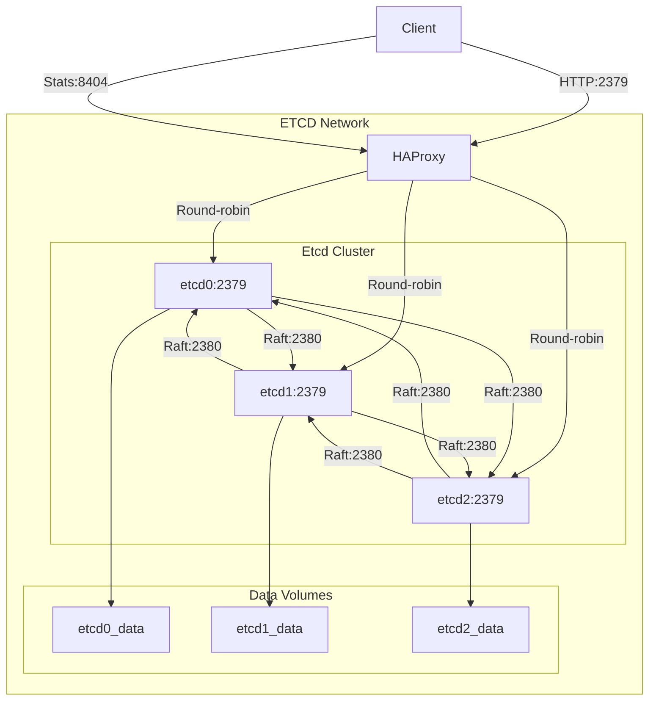

# Etcd Cluster Setup for High Availability

## Table of Contents

- [Overview](#overview)
- [What is Etcd?](#what-is-etcd)
- [Glossary of Terms](#glossary-of-terms)
- [Etcd Architecture Components](#etcd-architecture-components)
- [Best Practices](#best-practices)
- [Docker Run Tests](#docker-run-tests)
- [Use Cases for Etcd High Availability Cluster](#use-cases-for-etcd-high-availability-cluster)
- [Docker Compose `etcd.yaml` Components](#docker-compose-etcdyaml-components)

## Overview

This repository provides a Docker-based setup for a high-availability etcd cluster, 
designed for distributed coordination in systems like Milvus. The cluster consists 
of three etcd nodes (etcd0, etcd1, etcd2) for fault tolerance, a custom HAProxy load 
balancer for client traffic distribution, and persistent volumes for data durability. 
The configuration ensures reliable metadata storage, health monitoring, and efficient 
load balancing using Docker Compose.

## What is Etcd?

Etcd is a distributed key-value store designed for high availability, consistency, 
and reliability. According to the [official etcd documentation](https://etcd.io/docs/v3.3/learning/), 
etcd is built to handle critical coordination tasks in distributed systems. It provides:

- **Strong Consistency**: Uses the Raft consensus algorithm to ensure all nodes agree on data updates.
- **High Availability**: Supports replication across multiple nodes to tolerate failures.
- **Simple Interface**: Offers a key-value API with HTTP/gRPC endpoints for easy integration.
- **Watchable Keys**: Allows clients to monitor key changes in real-time.

Etcd is commonly used for storing configuration data, service discovery, and distributed locking in 
systems like Kubernetes and Milvus.

## Glossary of Terms

| Term              | Definition                                                                     |
|-------------------|--------------------------------------------------------------------------------|
| Raft Consensus    | Protocol ensuring all cluster nodes agree on data updates via replicated logs. |
| Key-Value Store   | Database storing data as unique key-value pairs.                               |
| gRPC              | High-performance framework for remote procedure calls, used by etcd.           |
| HAProxy           | TCP/HTTP load balancer distributing traffic across servers.                    |
| Health Check      | Mechanism to confirm a service’s operational status.                           |
| Docker Compose    | Tool for defining and running multi-container applications with YAML.          |
| Persistent Volume | Docker storage retaining data beyond container lifecycles.                     |
| Cluster Token     | Unique identifier preventing etcd cluster interference.                        |

## Etcd Architecture Components

The etcd architecture in this setup includes:

- **Nodes (etcd0, etcd1, etcd2)**: Three etcd instances forming a cluster, each running in a separate Docker container. They use the Raft algorithm to maintain consistency and replicate data.
- **HAProxy Load Balancer**: A front-end service that routes client traffic to healthy etcd nodes, exposing port 2379 for client connections and 8404 for a statistics page.
- **Persistent Volumes**: Separate volumes (`etcd0_data`, `etcd1_data`, `etcd2_data`) for each node to store data persistently, ensuring no data loss on container restarts.
- **Network**: A bridge network (`etcd-network`) for internal communication between etcd nodes and HAProxy, isolated from external access.
- **Health Checks**: Configured in Docker Compose to monitor etcd nodes using `etcdctl endpoint health` and HAProxy using version checks.


### Architecture Diagram


## Best Practices

- **Run Odd Number of Nodes**: Use 3, 5, or 7 nodes to ensure a majority for Raft consensus, balancing fault tolerance and performance.
- **Enable Authentication**: Uncomment `ETCD_AUTH_TOKEN`, `ETCD_ROOT_USER`, and `ETCD_ROOT_PASSWORD` in `etcd.yaml` for secure access control.
- **Monitor Health**: Regularly check the HAProxy stats page (port 8404) and etcd health endpoints to detect issues early.
- **Backup Data**: Periodically back up etcd data directories to prevent data loss from catastrophic failures.
- **Tune Resource Limits**: Adjust CPU and memory limits in `etcd.yaml` based on workload to prevent resource contention.
- **Use HTTPS in Production**: Configure SSL/TLS (as shown in commented `etcd.Dockerfile` entrypoint) for secure communication.
- **Compact Revisions**: Set `ETCD_AUTO_COMPACTION_RETENTION` to manage disk usage by removing old revisions.

## Docker Run Tests

To test the etcd cluster, use the following commands after deploying with `docker-compose up -d`:

1. **Check Cluster Health**:

  ```bash
   docker run --rm --network etcd-network quay.io/coreos/etcd:v3.5.18 etcdctl --endpoints=http://etcd0:2379,http://etcd1:2379,http://etcd2:2379 endpoint health
   docker run --rm --network etcd-network quay.io/coreos/etcd:v3.5.18 etcdctl --endpoints=http://etcd-proxy:2379 endpoint health
  ```

   Expected output: All endpoints report `healthy` status.
   Expected output: `etcd-proxy` reports `healthy` status for single node in round-robin.

2. **Check Cluster Members**:

  ```bash
   docker run --rm --network etcd-network quay.io/coreos/etcd:v3.5.18 etcdctl --endpoints=http://etcd0:2379,http://etcd1:2379,http://etcd2:2379 member list
   docker run --rm --network etcd-network quay.io/coreos/etcd:v3.5.18 etcdctl --endpoints=http://etcd-proxy:2379 member list
   ```

   Expected output: List of all cluster members with their IDs and statuses.

3. **Set and Get a Key**:

  ```bash
   docker run --rm --network etcd-network quay.io/coreos/etcd:v3.5.18 etcdctl --endpoints=http://etcd-proxy:2379 put testkey "Hello, etcd!"
   docker run --rm --network etcd-network quay.io/coreos/etcd:v3.5.18 etcdctl --endpoints=http://etcd-proxy:2379 get testkey
  ```

   Expected output: `testkey` with value `Hello, etcd!`.

4. **View HAProxy Stats**:

   Access `http://<IP Address of HAProxy Host>:18404` in a browser to view the HAProxy statistics page, showing etcd node status and traffic.

## Use Cases for Etcd High Availability Cluster

- **Kubernetes Metadata Storage**: Stores cluster state, such as pod configurations and service endpoints, ensuring reliable control plane operations.
- **Service Discovery**: Maintains a registry of services for dynamic discovery in microservices architectures.
- **Distributed Locking**: Coordinates tasks across distributed systems, preventing race conditions in applications like job schedulers.
- **Configuration Management**: Centralizes configuration data for applications, enabling dynamic updates without restarts.
- **Milvus Metadata**: Manages metadata for Milvus vector databases, supporting high-availability search and analytics.

## Docker Compose `etcd.yaml` Components

The `etcd.yaml` file defines the etcd cluster and HAProxy setup using Docker Compose. Key components include:

- **Variables Section (`x-variables`)**:
  - `etcd_environment_vars`: Shared environment variables for etcd nodes, configuring cluster settings like `ETCD_INITIAL_CLUSTER`, `ETCD_DATA_DIR`, and `ETCD_QUOTA_BACKEND_BYTES`.
  - `etcd_commons`: Common configuration for etcd services, including build context (`etcd.Dockerfile`), exposed ports (2379, 2380), network, health checks, and resource limits.

- **Services**:
  - `etcd0`, `etcd1`, `etcd2`: Three etcd nodes with unique hostnames, environment variables (e.g., `ETCD_NAME`, `ETCD_ADVERTISE_CLIENT_URLS`), and persistent volumes. Each inherits `etcd_commons`.
  - `haproxy`: HAProxy service built from `haproxy.Dockerfile`, exposing port 2379, depending on healthy etcd nodes, and using a health check to verify HAProxy status. HAProxy statistics page are available on port 18404.

- **Networks**:
  - `etcd-network`: A bridge network for internal communication, isolated with `internal: true` to prevent external access.

- **Volumes**:
  - `etcd0_data`, `etcd1_data`, `etcd2_data`: Persistent volumes for each etcd node to store data, ensuring durability across container restarts.
  - `haproxy_data`: Volume for HAProxy configuration, mapping to `/usr/local/etc/haproxy`.

This setup ensures a robust, scalable etcd cluster with load balancing and fault tolerance, suitable for production environments.