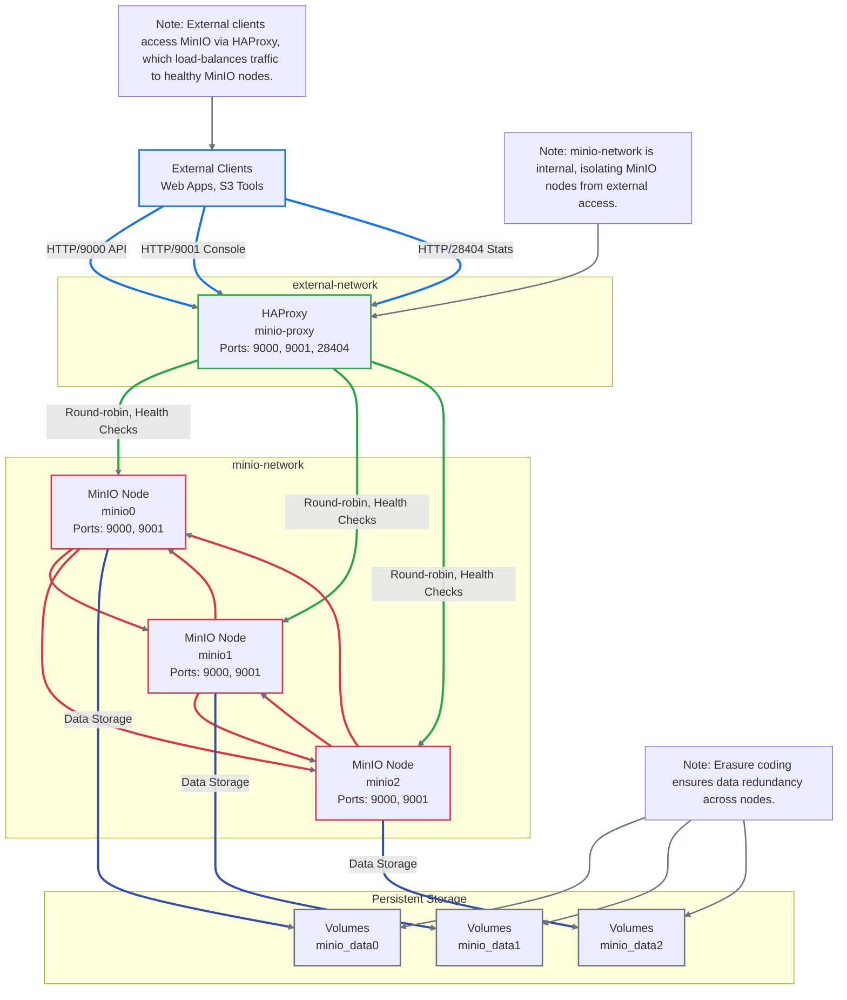

# MinIO High-Availability Cluster Setup

## Table of Contents
- [Overview](#overview)
- [What is MinIO?](#what-is-minio)
- [Glossary](#glossary)
- [MinIO Architecture Components](#minio-architecture-components)
- [Best Practices](#best-practices)
- [Docker Run Tests](#docker-run-tests)
- [Use Cases for High-Availability MinIO Cluster](#use-cases-for-high-availability-minio-cluster)
- [Docker Compose Components](#docker-compose-components)
- [Network Architecture Diagram](#network-architecture-diagram)

## Overview
This project sets up a high-availability (HA) MinIO cluster using Docker Compose, designed for scalable, S3-compatible object storage. The cluster consists of three MinIO nodes (minio0, minio1, minio2) behind an HAProxy load balancer, ensuring fault tolerance and load distribution. The setup uses erasure coding for data redundancy, persistent storage volumes, and health checks to maintain reliability. The MinIO nodes communicate over an internal network, while HAProxy exposes API (port 9000) and console (port 9001) endpoints to external clients.

## What is MinIO?
MinIO is a high-performance, S3-compatible object storage system designed for cloud-native applications, AI/ML workloads, and large-scale data lakes. According to the [MinIO documentation](https://min.io/docs/minio/container/index.html), it is lightweight, supports distributed deployments, and provides enterprise-grade features like erasure coding, encryption, and event notifications. The [DirectPV documentation](https://min.io/docs/directpv/) highlights MinIO's ability to leverage Direct Attached Storage (DAS) for optimized performance in containerized environments, making it ideal for Kubernetes and Docker-based setups.

Key features include:
- **S3 Compatibility**: Fully compatible with AWS S3 APIs, enabling seamless integration with S3-based tools.
- **Erasure Coding**: Distributes data and parity across nodes to ensure data integrity and fault tolerance.
- **High Availability**: Supports distributed setups to prevent single points of failure.
- **Scalability**: Scales horizontally by adding nodes to handle petabytes of data.

## Glossary
- **Erasure Coding**: A data protection method that splits data into fragments, adds parity information, and distributes it across multiple nodes to ensure data recovery in case of node failures.
- **S3-Compatible**: Conforms to Amazon S3 API standards, allowing applications to interact with MinIO as they would with AWS S3.
- **HAProxy**: A high-performance TCP and HTTP load balancer that distributes incoming traffic across multiple backend servers.
- **Health Check**: Periodic tests to verify the availability and functionality of a service or container.
- **Webhook Notifications**: Automated HTTP callbacks triggered by specific events in MinIO, such as object creation or deletion.
- **Docker Compose**: A tool for defining and running multi-container Docker applications using YAML files.
- **Persistent Volume**: A storage resource in Docker that retains data beyond the lifecycle of a container.

## MinIO Architecture Components
The MinIO HA cluster architecture includes:
1. **MinIO Nodes (minio0, minio1, minio2)**:
   - Each node runs the MinIO server, handling object storage operations.
   - Configured with erasure coding to distribute data and parity across nodes.
   - Exposes API (port 9000) and console (port 9001) endpoints.
   - Uses persistent volumes (`/data`) to store objects durably.
2. **HAProxy Load Balancer (minio-proxy)**:
   - Distributes incoming API and console traffic across MinIO nodes using round-robin balancing.
   - Performs health checks to route traffic only to healthy nodes.
   - Exposes ports 9000 (API), 9001 (console), and 8404 (HAProxy stats).
3. **Docker Networks**:
   - `minio-network`: An internal bridge network for secure communication between MinIO nodes and HAProxy.
   - `external-network`: A bridge network for external client access to HAProxy.
4. **Persistent Volumes**:
   - Three volumes (`minio_data0`, `minio_data1`, `minio_data2`) ensure data persistence for each MinIO node.

## Best Practices
- **Security**:
  - Use strong credentials for `MINIO_ROOT_USER` and `MINIO_ROOT_PASSWORD`.
  - Enable TLS for production deployments to secure API and console traffic.
  - Restrict access to the HAProxy stats page (port 8404) using network policies.
- **Performance**:
  - Allocate sufficient CPU and memory resources (e.g., 1 CPU, 512MB memory per MinIO node).
  - Use high-performance storage (e.g., SSDs) for persistent volumes to reduce latency.
- **High Availability**:
  - Deploy at least three MinIO nodes to ensure erasure coding and fault tolerance.
  - Configure HAProxy health checks to detect and isolate unhealthy nodes.
- **Monitoring**:
  - Enable MinIO Prometheus metrics (`MINIO_PROMETHEUS_AUTH_TYPE: public`) for performance monitoring.
  - Regularly check HAProxy stats (`http://<haproxy>:8404`) for load distribution insights.
- **Backup**:
  - Implement regular backups of MinIO data using MinIO's `mc mirror` command.
  - Test data restoration procedures to ensure recoverability.

## Docker Run Tests
The following `docker run` commands can be used to test individual components of the MinIO cluster. Note: These are for testing purposes and assume the Docker images are built from the provided Dockerfiles.

1. **Test a Single MinIO Node**:
   ```bash
   docker run -d --name minio_test \
     -p 9000:9000 -p 9001:9001 \
     -e "MINIO_ROOT_USER=minioadmin" \
     -e "MINIO_ROOT_PASSWORD=WW91ckdyYWZhbmFTdHJvbmdQYXNzd29yZDEyMw" \
     -v minio_data_test:/data \
     minio/minio:RELEASE.2025-04-08T15-41-24Z \
     server /data --console-address ":9001"
   ```
   - Verify the node is running: `curl -I http://localhost:9000/minio/health/live`
   - Access the console: `http://localhost:9001`

2. **Test HAProxy**:
   ```bash
   docker run -d --name haproxy_test \
     -p 9000:9000 -p 9001:9001 -p 8404:8404 \
     -v $(pwd)/cfg/haproxy.cfg:/usr/local/etc/haproxy/haproxy.cfg \
     haproxy:lts \
     haproxy -f /usr/local/etc/haproxy/haproxy.cfg
   ```
   - Check HAProxy stats: `http://localhost:8404`
   - Verify HAProxy version: `docker exec haproxy_test haproxy -v`

3. **Clean Up**:
   ```bash
   docker rm -f minio_test haproxy_test
   docker volume rm minio_data_test
   ```

## Use Cases for High-Availability MinIO Cluster
- **Data Lakes**: Store and manage petabytes of unstructured data for analytics and machine learning workloads.
- **Backup and Archiving**: Provide durable, S3-compatible storage for backups and long-term data retention.
- **Content Delivery**: Serve static assets (e.g., images, videos) for web applications with low latency.
- **AI/ML Workflows**: Store large datasets and model artifacts for training and inference pipelines.
- **Hybrid Cloud Storage**: Enable seamless data migration between on-premises and cloud environments using S3 APIs.

## Docker Compose Components
The `minio.yaml` Docker Compose file defines the HA MinIO cluster with the following components:

1. **Common Configuration (`x-minio-common`)**:
   - Builds the MinIO image from `minio.Dockerfile`.
   - Specifies the command: `server --console-address ":9001" http://minio0/data http://minio1/data http://minio2/data`.
   - Sets environment variables for credentials, region, Prometheus, and webhook notifications.
   - Configures health checks using `curl` to verify node liveness.
   - Defines resource limits (1 CPU, 512MB memory) and reservations (0.5 CPU, 256MB memory).
   - Connects to the `minio-network` for internal communication.

2. **MinIO Services (minio0, minio1, minio2)**:
   - Each service inherits `x-minio-common` and maps a unique persistent volume (`minio_data0`, `minio_data1`, `minio_data2`).
   - Configured with unique container names and hostnames for network resolution.

3. **HAProxy Service (minio-proxy)**:
   - Builds the HAProxy image from `haproxy.Dockerfile`.
   - Exposes ports 9000 (API), 9001 (console), and 28404 (stats, mapped to 8404 internally).
   - Depends on healthy MinIO nodes (`service_healthy` condition).
   - Performs health checks to verify HAProxy availability.
   - Connects to both `minio-network` (for backend communication) and `external-network` (for client access).

4. **Networks**:
   - `minio-network`: Internal bridge network for secure communication between MinIO nodes and HAProxy.
   - `external-network`: Bridge network for external client access to HAProxy.

5. **Volumes**:
   - `minio_data0`, `minio_data1`, `minio_data2`: Persistent volumes for each MinIO node to ensure data durability.

## Network Architecture Diagram
The following Mermaid diagram illustrates the network isolation layers of the MinIO HA cluster, with detailed documentation and visual styling.



### Diagram Explanation
- **External Clients**: Represent applications or tools accessing the MinIO cluster via S3 APIs, console, or HAProxy stats.
- **External Network**: Contains HAProxy, which exposes ports 9000 (API), 9001 (console), and 28404 (stats) to clients.
- **Internal Network**: Isolates MinIO nodes and HAProxy for secure communication, preventing direct external access to MinIO nodes.
- **Persistent Storage**: Represents Docker volumes for data durability, with each MinIO node mapped to a unique volume.
- **Erasure Coding**: Illustrated by connections from MinIO nodes to storage, indicating data distribution for redundancy.
- **Health Checks**: HAProxy performs HTTP health checks (`/minio/health/live` for console, `/minio/health/cluster` for API) to ensure traffic is routed to healthy nodes.
- **Visual Styling**: Uses distinct colors for each layer (blue for clients, green for external network, yellow for internal network, red for MinIO nodes, gray for storage) to enhance clarity.