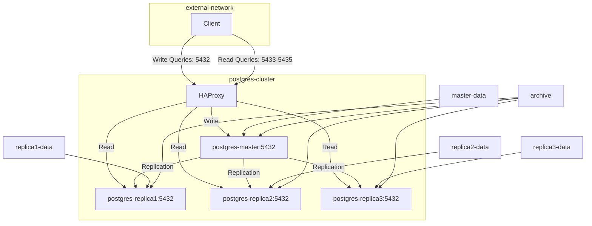

# High-Availability PostgreSQL Cluster with Docker Compose

This project sets up a high-availability PostgreSQL 17.5 cluster using Docker Compose, with one master node for write operations and three replica nodes for read-only queries. HAProxy balances traffic, directing writes to the master and reads to replicas. A client container tests the setup to ensure everything works correctly.

## Table of Contents
1. [Overview](#overview)
2. [Architecture](#architecture)
   - [Directory Structure](#directory-structure)
3. [Prerequisites](#prerequisites)
4. [Setup Instructions](#setup-instructions)
5. [Configuration Details](#configuration-details)
   - [Docker Compose](#docker-compose)
   - [PostgreSQL Configuration](#postgresql-configuration)
   - [HAProxy Configuration](#haproxy-configuration)
   - [Client Testing](#client-testing)
6. [Mermaid Diagram](#mermaid-diagram)
7. [Testing the Cluster](#testing-the-cluster)
8. [Best Practices](#best-practices)
9. [References](#references)

## Overview
This setup creates a robust PostgreSQL cluster with:
- **Master Node**: Handles all write operations (INSERT, UPDATE, DELETE).
- **Replica Nodes**: Three read-only replicas for load-balanced read queries (SELECT).
- **HAProxy**: Directs traffic to the appropriate nodes.
- **Client**: Tests connectivity, CRUD operations, and replication.
- **Docker Compose**: Manages all services and networks.

The cluster uses streaming replication for high availability and persistent volumes for data durability.

## Architecture
The system consists of:
- **postgres-master**: The primary database for writes.
- **postgres-replica1, replica2, replica3**: Read-only copies of the master.
- **postgres-haproxy**: Load balancer directing traffic.
- **client**: Tests the cluster functionality.
- **Networks**: `postgres-cluster` (internal) and `external-network` (client access).
- **Volumes**: Persistent storage for data and WAL archives.

### Directory Structure

```text
.
├── cfg/
│   ├── postgresql-base.conf
│   ├── postgresql-master.conf
│   ├── postgresql-replica.conf
│   ├── pg_hba.conf
│   └── haproxy.cfg
├── secrets/
│   ├── postgres_password.txt
│   └── repl_password.txt
├── docker-compose.yml
├── postgres.Dockerfile
├── haproxy.Dockerfile
├── client.Dockerfile
├── init-replica.sh
├── postgres_test.sh
└── README.md
```
## Prerequisites
- Docker and Docker Compose installed.
- Basic understanding of PostgreSQL and Docker.
- A text editor to create secret files.

## Setup Instructions
1. **Create Secret Files**:
   Create a `secrets` directory and add password files:
   ```bash
   mkdir secrets
   echo "securepassword123" > secrets/postgres_password.txt
   echo "replpassword123" > secrets/repl_password.txt
   ```

2. **Create Configuration Directory**:
   ```bash
   mkdir cfg
   ```
   Copy the configuration files (`postgresql-base.conf`, `postgresql-master.conf`, `postgresql-replica.conf`, `pg_hba.conf`, `haproxy.cfg`) to the `cfg` directory.

3. **Build and Run**:
   ```bash
   docker-compose up -d
   ```

4. **Verify Setup**:
   Check the client container logs:
   ```bash
   docker logs postgres-tester
   ```

5. **Access HAProxy Stats**:
   Open `http://<Docker Host>:8080/stats` in a browser (username: admin, password: admin123).

## Configuration Details

### Docker Compose
- **File**: `docker-compose.yml`
- Defines services, networks, volumes, and secrets.
- Uses `postgres:17.5` and `haproxy:lts` images.
- Maps ports 5432 (master), 5433–5435 (replicas), and 8080 (stats).
- Uses secrets for passwords to enhance security.

### PostgreSQL Configuration
- **postgresql-base.conf**: Shared settings for all nodes (e.g., `listen_addresses`, `max_connections`).
- **postgresql-master.conf**: Master-specific settings (e.g., `archive_mode=on`).
- **postgresql-replica.conf**: Replica-specific settings (e.g., `hot_standby=on`, `default_transaction_read_only=on`).
- **pg_hba.conf**: Controls authentication with SCRAM-SHA-256.
- **init-replica.sh**: Initializes replicas with `pg_basebackup` and sets up replication.

### HAProxy Configuration
- **haproxy.cfg**:
  - `frontend_postgres_write`: Directs write queries to the master (port 5432).
  - `frontend_postgres_read`: Distributes read queries to replicas (port 5433).
  - Uses `pgsql-check` to verify server roles.
  - Stats page at port 8080.

### Client Testing
- **postgres_test.sh**:
  - Tests connectivity, table creation, data insertion, and replication.
  - Verifies read-only enforcement on replicas.
  - Checks HAProxy stats.

## Mermaid Diagram

```mermaid
graph TD
    A[Client] -->|Write Queries: 5432| B[HAProxy]
    A -->|Read Queries: 5433-5435| B
    B -->|Write| C[postgres-master:5432]
    B -->|Read| D[postgres-replica1:5432]
    B -->|Read| E[postgres-replica2:5432]
    B -->|Read| F[postgres-replica3:5432]
    C -->|Replication| D
    C -->|Replication| E
    C -->|Replication| F
    G[master-data] --> C
    H[replica1-data] --> D
    I[replica2-data] --> E
    J[replica3-data] --> F
    K[archive] --> C
    K --> D
    K --> E
    K --> F

    subgraph postgres-cluster
        C
        D
        E
        F
        B
    end

    subgraph external-network
        A
        B
    end
```
This diagram shows how the client connects to HAProxy, which routes write queries to the master and read queries to replicas. The master replicates data to the replicas, and all nodes use persistent volumes for data storage.

## Testing the Cluster
1. **Check Logs**:
   ```bash
   docker logs postgres-master
   docker logs postgres-replica1
   docker logs postgres-tester
   ```

2. **Test Queries**:
   Connect to the master:
   ```bash
   docker exec -it postgres-master psql -U admin -d milvus
   ```
   Run `SELECT * FROM test_table;`.

3. **Test Replication**:
   Connect to a replica (port 5433):
   ```bash
   docker run -it postgres:17.5 psql -h localhost -p 5433 -U admin -d milvus
   ```
   Verify data with `SELECT * FROM test_table;`.

4. **Check HAProxy Stats**:
   Open `http://localhost:8080/stats` to monitor server status.

## Best Practices
- Use secrets for passwords.
- Configure `pg_hba.conf` with SCRAM-SHA-256 for secure authentication.
- Set `default_transaction_read_only=on` on replicas.
- Use persistent volumes for data and WAL archives.
- Monitor replication with `pg_stat_replication`.
- Regularly back up WAL archives.

## References
- [PostgreSQL 17 Documentation: Replication](https://www.postgresql.org/docs/17/runtime-config-replication.html)
- [PostgreSQL 17 Documentation: Client Authentication](https://www.postgresql.org/docs/17/client-authentication.html)
- [PostgreSQL 17 Documentation: File Locations](https://www.postgresql.org/docs/17/runtime-config-file-locations.html)
- [HAProxy Documentation](http://www.haproxy.org/)
- [Docker Compose Documentation](https://docs.docker.com/compose/)