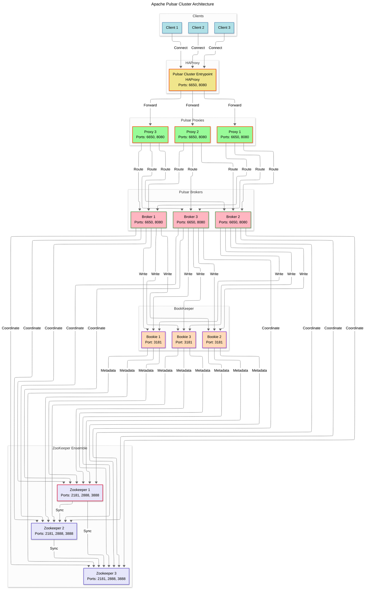

# Apache Pulsar Cluster Implementation

This document provides a comprehensive guide to the Apache Pulsar cluster implementation using Docker. It includes an overview of Apache Pulsar, its use cases, pros and cons, a detailed explanation of the cluster architecture, a Mermaid diagram, test cases for verification, and documentation of the configuration files and services.

## Table of Contents

- [Overview](#overview)
- [What is Apache Pulsar?](#what-is-apache-pulsar)
  - [Definition and Purpose](#definition-and-purpose)
  - [Use Cases](#use-cases)
  - [Pros and Cons](#pros-and-cons)
  - [Why a Cluster Implementation?](#why-a-cluster-implementation)
- [Cluster Architecture](#cluster-architecture)
  - [Cluster Diagram](#apache-pulsar-cluster-diagram)
- [Configuration and Services](#configuration-and-services)
  - [Docker Compose Services](#docker-compose-services)
  - [Configuration Files](#configuration-files)
- [Testing and Verification](#testing-and-verification)
  - [Test Cases](#test-cases)
- [External Container Testing](#external-container-testing)
  - [Setup](#setup)
  - [External Container Test Cases](#external-container-test-cases)
  - [Additional Pulsar-Admin Use Cases](#additional-pulsar-admin-use-cases)
- [Best Practices](#best-practices)
- [Conclusion](#conclusion)
- [Glossary](#glossary)

## Overview

This Apache Pulsar cluster implementation deploys a high-availability messaging system 
using Docker Compose. The setup includes a ZooKeeper ensemble, BookKeeper nodes, Pulsar 
brokers, proxy nodes, and an HAProxy load balancer to ensure scalability, fault tolerance, 
and efficient load distribution. The implementation is designed for production-grade 
environments requiring reliable message streaming and processing, such as those supporting 
Milvus high-availability setups.

## What is Apache Pulsar?

### Definition and Purpose

Apache Pulsar is an open-source, distributed messaging and streaming platform designed for 
high-performance, scalable, and fault-tolerant data processing. It combines the flexibility 
of a publish-subscribe messaging system with the durability and scalability of a log-based 
streaming platform. Pulsar is built to handle large-scale, real-time data pipelines and is 
widely used in cloud-native applications.

According to the Apache Pulsar documentation (https://pulsar.apache.org/reference/#/4.0.x/), Pulsar provides:
- **Multi-tenancy**: Supports multiple tenants, namespaces, and topics within a single cluster.
- **Geo-replication**: Enables data replication across geographically distributed clusters.
- **Tiered storage**: Offloads data to long-term storage (e.g., S3, GCS) for cost efficiency.
- **Unified messaging model**: Combines queueing and streaming semantics for diverse workloads.

**Non-standard term**: *Multi-tenancy* refers to a system architecture where a single instance 
serves multiple isolated users or groups (tenants), ensuring data separation and resource sharing.

### Use Cases

Pulsar is suitable for various applications, including:
- **Event streaming**: Processing real-time data from IoT devices, logs, or user interactions.
- **Microservices communication**: Enabling decoupled, asynchronous messaging between services.
- **Data pipelines**: Building ETL (Extract, Transform, Load) workflows for analytics.
- **Machine learning**: Feeding real-time data to ML models for inference or training.

In this implementation, Pulsar serves as the messaging backbone for a Milvus high-availability 
setup, ensuring reliable data exchange between distributed components.

### Pros and Cons

**Pros**:
- **Scalability**: Horizontally scales by adding brokers or bookies without downtime.
- **Fault tolerance**: Replicates data across bookies and uses ZooKeeper for consistent metadata.
- **Low latency**: Provides sub-millisecond latency for message delivery.
- **Flexibility**: Supports both streaming and queueing via subscriptions.
- **Geo-replication**: Simplifies cross-region data synchronization.

**Cons**:
- **Complexity**: Managing a cluster with ZooKeeper, BookKeeper, and brokers requires expertise.
- **Resource intensive**: Requires significant memory and storage for high-throughput workloads.
- **Learning curve**: Configuring multi-tenancy, schemas, and subscriptions can be challenging.

### Why a Cluster Implementation?

A cluster implementation is ideal for this use case due to:
- **High availability**: The three-node ZooKeeper ensemble, BookKeeper, and broker setups ensure no single point of failure.
- **Load balancing**: HAProxy and Pulsar proxies distribute traffic across brokers, preventing bottlenecks.
- **Scalability**: Additional brokers or bookies can be added to handle increased load.
- **Fault tolerance**: Data replication across bookies and ZooKeeper's quorum-based consensus protect against node failures.
- **Milvus compatibility**: Milvus requires a robust messaging system for distributed vector search, which Pulsar’s cluster provides.

A standalone Pulsar instance, while simpler, lacks the redundancy and scalability needed for production-grade Milvus deployments.

## Cluster Architecture

The cluster consists of:
- **ZooKeeper ensemble** (3 nodes): Manages metadata and coordination.
- **BookKeeper nodes** (3 nodes): Stores message data durably.
- **Pulsar brokers** (3 nodes): Handle message routing and client connections.
- **Pulsar proxies** (3 nodes): Provide a unified entry point for clients.
- **HAProxy**: Load balances traffic across proxies.

### Apache Pulsar Cluster Diagram

The following diagram illustrates the cluster architecture:



**Description**:
- Clients connect to HAProxy, which routes traffic to Pulsar proxies.
- Proxies forward requests to brokers, which handle message processing.
- Brokers store messages in BookKeeper and use ZooKeeper for metadata.
- ZooKeeper nodes form a quorum for consistent coordination.

## Configuration and Services

### Docker Compose Services

The `pulsar.yaml` file defines the following services:

1. **ZooKeeper Ensemble (zookeeper1, zookeeper2, zookeeper3)**:
   - **Purpose**: Manages metadata and coordination for Pulsar components.
   - **Image**: Built from `base.Dockerfile` with `NODE_TYPE=zookeeper`.
   - **Ports**: 2181 (client), 2888 (leader-follower), 3888 (leader election).
   - **Volumes**: Persistent storage at `/pulsar/data/zookeeper`.
   - **Healthcheck**: Uses `pulsar-zookeeper-ruok.sh` to verify status.
   - **Environment**: Sets `SERVERID` and JVM memory options.

2. **Pulsar Initialization (pulsar-init)**:
   - **Purpose**: Initializes cluster metadata in ZooKeeper.
   - **Image**: `apachepulsar/pulsar:4.0.4`.
   - **Command**: Runs `pulsar initialize-cluster-metadata` to set cluster parameters.
   - **Depends On**: Healthy ZooKeeper nodes.

3. **BookKeeper Nodes (bookie1, bookie2, bookie3)**:
   - **Purpose**: Stores message data durably.
   - **Image**: Built from `base.Dockerfile` with `NODE_TYPE=bookkeeper`.
   - **Ports**: 3181 (bookie server).
   - **Volumes**: Persistent storage at `/pulsar/data/bookkeeper`.
   - **Environment**: Sets `ADVERTISED_ADDRESS` and `BOOKIEID`.

4. **Pulsar Brokers (broker1, broker2, broker3)**:
   - **Purpose**: Handles message routing and client connections.
   - **Image**: Built from `base.Dockerfile` with `NODE_TYPE=broker`.
   - **Ports**: 6650 (binary protocol), 8080 (HTTP admin API).
   - **Environment**: Sets `ADVERTISED_ADDRESS` and JVM memory options.

5. **Pulsar Proxies (proxy1, proxy2, proxy3)**:
   - **Purpose**: Provides a unified entry point for clients.
   - **Image**: Built from `base.Dockerfile` with `NODE_TYPE=proxy`.
   - **Ports**: 6650, 8080.
   - **Environment**: Sets JVM memory options.

6. **HAProxy (pulsar-proxy)**:
   - **Purpose**: Load balances traffic across proxies.
   - **Image**: Built from `haproxy.Dockerfile`.
   - **Ports**: 6650, 8080 (exposed to host).
   - **Healthcheck**: Verifies HAProxy version.

### Configuration Files

1. **haproxy.cfg**:
   - Configures HAProxy for load balancing.
   - **Global**: Sets max connections, logging, and stats socket.
   - **Defaults**: Defines timeouts, retries, and TCP mode.
   - **Frontend/Backend**:
     - `pulsar_frontend`/`pulsar_backend`: Routes TCP traffic (port 6650) to proxies with health checks.
     - `http_frontend`/`http_backend`: Routes HTTP traffic (port 8080) with `/metrics` checks.

2. **proxy.conf**:
   - Configures Pulsar proxies.
   - **Key Settings**:
     - Connects to ZooKeeper for metadata (`metadataStoreUrl`).
     - Defines ports (6650, 8080).
     - Limits broker connections (`brokerProxyAllowedHostNames`).
     - Disables authentication/authorization for simplicity.
     - Sets JVM options (1GB heap).

3. **zookeeper.conf**:
   - Configures the ZooKeeper ensemble.
   - **Key Settings**:
     - `tickTime=2000`: Heartbeat interval.
     - `dataDir=/pulsar/data/zookeeper`: Persistent storage.
     - `clientPort=2181`: Client connections.
     - Defines three servers for the ensemble.
     - Sets JVM options (512MB heap).

4. **bookkeeper.conf**:
   - Configures BookKeeper nodes.
   - **Key Settings**:
     - `bookiePort=3181`: Server port.
     - `advertisedAddress`: Set via environment variable.
     - `zkServers`: Connects to ZooKeeper.
     - `journalDirectory`, `ledgerDirectories`: Persistent storage.
     - Enables auto-recovery and sets JVM options (1GB heap).

5. **broker.conf**:
   - Configures Pulsar brokers.
   - **Key Settings**:
     - Connects to ZooKeeper (`zookeeperServers`).
     - `brokerServicePort=6650`, `webServicePort=8080`.
     - `advertisedAddress`: Set via environment variable.
     - Configures replication (`managedLedgerDefaultEnsembleSize=2`).
     - Enables load balancing and topic cleanup.
     - Sets JVM options (1GB heap).

6. **base.Dockerfile**:
   - Builds images for ZooKeeper, BookKeeper, brokers, and proxies.
   - Copies configuration files and applies environment variables.
   - Sets permissions and creates data directories.

7. **haproxy.Dockerfile**:
   - Builds the HAProxy image.
   - Copies `haproxy.cfg` and sets permissions.
   - Exposes ports 6650 and 8080.

## Testing and Verification

The following test cases use `pulsar-admin` and `curl` to verify the cluster’s functionality. Run these tests from a container with `apachepulsar/pulsar:4.0.4` and network access to the cluster.

### Test Cases

1. **Verify ZooKeeper Health**:
   ```bash
   echo ruok | nc zookeeper1 2181
   ```
   **Expected Output**: `imok`

2. **List ZooKeeper Nodes**:
   ```bash
   pulsar-admin --admin-url http://pulsar-proxy:8080  zookeeper-shell --zookeeper zookeeper1:2181 ls /zookeeper
   ```
   **Expected Output**: Lists nodes like `quota`, `zookeeper`.

3. **Check BookKeeper Status**:
   ```bash
   curl -s http://bookie1:8000/api/v1/bookkeeper/health
   ```
   **Expected Output**: `{"status":"OK"}` or no error.

4. **Verify BookKeeper Disk Usage**:
   ```bash
   curl -s http://bookie1:8000/api/v1/bookkeeper/disk_usage
   ```
   **Expected Output**: JSON with disk usage details.

5. **List Brokers**:
   ```bash
   pulsar-admin --admin-url http://pulsar-proxy:8080 brokers list cluster-a 
   ```
   **Expected Output**: Lists `broker1`, `broker2`, `broker3`.

6. **Check Broker Health**:
   ```bash
   pulsar-admin --admin-url http://pulsar-proxy:8080 brokers healthcheck 
   ```
   **Expected Output**: `Ok`

7. **Create a Namespace**:
   ```bash
   pulsar-admin --admin-url http://pulsar-proxy:8080 namespaces create test-tenant/test-namespace 
   ```
   **Expected Output**: No output (success).

8. **List Namespaces**:
   ```bash
   pulsar-admin --admin-url http://pulsar-proxy:8080 namespaces list test-tenant 
   ```
   **Expected Output**: Includes `test-tenant/test-namespace`.

9. **Create a Topic**:
   ```bash
   pulsar-admin --admin-url http://pulsar-proxy:8080 topics create persistent://test-tenant/test-namespace/test-topic 
   ```
   **Expected Output**: No output (success).

10. **List Topics**:
    ```bash
    pulsar-admin --admin-url http://pulsar-proxy:8080 topics list test-tenant/test-namespace 
    ```
    **Expected Output**: Includes `persistent://test-tenant/test-namespace/test-topic`.

11. **Produce a Message**:
    ```bash
    pulsar-admin --admin-url http://pulsar-proxy:8080 topics produce persistent://test-tenant/test-namespace/test-topic --messages "Hello Pulsar" 
    ```
    **Expected Output**: No output (success).

12. **Consume a Message**:
    ```bash
    pulsar-admin --admin-url http://pulsar-proxy:8080 topics consume persistent://test-tenant/test-namespace/test-topic --subscription-name test-sub 
    ```
    **Expected Output**: Includes `Hello Pulsar`.

13. **Check Topic Stats**:
    ```bash
    pulsar-admin --admin-url http://pulsar-proxy:8080 topics stats persistent://test-tenant/test-namespace/test-topic 
    ```
    **Expected Output**: JSON with message count and subscription details.

14. **Check Proxy Metrics**:
    ```bash
    curl -s http://proxy1:8080/metrics
    ```
    **Expected Output**: Prometheus-format metrics.

15. **Verify HAProxy Status**:
    ```bash
    echo "show stat" | nc pulsar-proxy 8080
    ```
    **Expected Output**: HAProxy statistics.

16. **Test Load Balancing**:
    ```bash
    for i in {1..10}; do curl -s http://pulsar-proxy:8080/metrics | grep pulsar; done
    ```
    **Expected Output**: Metrics from different proxies, indicating load distribution.

17. **Create a Subscription**:
    ```bash
    pulsar-admin --admin-url http://pulsar-proxy:8080 topics subscribe persistent://test-tenant/test-namespace/test-topic --subscription-name test-sub2 
    ```
    **Expected Output**: No output (success).

18. **Check Subscription Stats**:
    ```bash
    pulsar-admin --admin-url http://pulsar-proxy:8080 topics stats persistent://test-tenant/test-namespace/test-topic --get-subscriptions test-sub2 
    ```
    **Expected Output**: JSON with subscription details.

19. **Test Message Retention**:
    ```bash
    pulsar-admin --admin-url http://pulsar-proxy:8080 namespaces set-retention test-tenant/test-namespace --time 1h --size 1G 
    ```
    **Expected Output**: No output (success).

20. **Verify Cluster Metadata**:
    ```bash
    pulsar-admin --admin-url http://pulsar-proxy:8080 clusters get cluster-a 
    ```
    **Expected Output**: JSON with cluster details.

## External Container Testing

This section outlines how to test the Pulsar cluster using an external Docker container, 
including setup instructions, 20 test cases, and 20 additional `pulsar-admin` use cases 
for advanced administration. The tests verify the cluster's functionality, and the use 
cases demonstrate administrative capabilities.

### Setup

To perform testing, launch an external Docker container with the Pulsar image and 
connect it to the `pulsar` network defined in `pulsar.yaml`. Use the following command:

```bash
docker run -it --rm --network pulsar apachepulsar/pulsar:4.0.4 bash
```

From within the container, ensure `pulsar-admin`, `pulsar-client`, and `curl` are available. 
The container will communicate with the cluster via `pulsar-proxy` on ports 6650 (binary protocol) 
and 8080 (HTTP admin API).

### External Container Test Cases

These tests verify the cluster's functionality using `pulsar-client`, `curl`, and basic shell commands. Run them from the external container.

1. **Test Pulsar Client Connectivity**:
   ```bash
   pulsar-client produce persistent://test-tenant/test-namespace/test-topic --messages "Test Connectivity" -n 1
   ```
   **Expected Output**: `1 messages successfully produced`

2. **Consume Message with Pulsar Client**:
   ```bash
   pulsar-client consume persistent://test-tenant/test-namespace/test-topic -s test-sub3 -n 1
   ```
   **Expected Output**: Displays `Test Connectivity`.

3. **Check Proxy Health via HTTP**:
   ```bash
   curl -s http://pulsar-proxy:8080/status.html
   ```
   **Expected Output**: HTTP 200 OK response.

4. **Verify BookKeeper Ledger Count**:
   ```bash
   curl -s http://bookie1:8000/api/v1/bookkeeper/ledger_count
   ```
   **Expected Output**: JSON with ledger count.

5. **Test ZooKeeper Connection**:
   ```bash
   echo stat | nc zookeeper1 2181
   ```
   **Expected Output**: ZooKeeper connection statistics.

6. **Check Broker Metrics**:
   ```bash
   curl -s http://broker1:8080/metrics | grep pulsar
   ```
   **Expected Output**: Prometheus-format metrics.

7. **Produce Multiple Messages**:
   ```bash
   pulsar-client produce persistent://test-tenant/test-namespace/test-topic --messages "Message $i" -n 10
   ```
   **Expected Output**: `10 messages successfully produced`

8. **Consume Multiple Messages**:
   ```bash
   pulsar-client consume persistent://test-tenant/test-namespace/test-topic -s test-sub4 -n 10
   ```
   **Expected Output**: Displays 10 messages.

9. **Test Topic Partition Creation**:
   ```bash
   pulsar-admin --admin-url http://pulsar-proxy:8080 topics create-partitioned-topic persistent://test-tenant/test-namespace/partitioned-topic --partitions 3 
   ```
   **Expected Output**: No output (success).

10. **List Partitioned Topics**:
    ```bash
    pulsar-admin --admin-url http://pulsar-proxy:8080 topics list-partitioned-topics test-tenant/test-namespace 
    ```
    **Expected Output**: Includes `persistent://test-tenant/test-namespace/partitioned-topic`.

11. **Produce to Partitioned Topic**:
    ```bash
    pulsar-client produce persistent://test-tenant/test-namespace/partitioned-topic --messages "Partition Test" -n 1
    ```
    **Expected Output**: `1 messages successfully produced`

12. **Consume from Partitioned Topic**:
    ```bash
    pulsar-client consume persistent://test-tenant/test-namespace/partitioned-topic -s test-sub5 -n 1
    ```
    **Expected Output**: Displays `Partition Test`.

13. **Check HAProxy Health**:
    ```bash
    curl -s http://pulsar-proxy:8080/haproxy?stats
    ```
    **Expected Output**: HAProxy statistics page.

14. **Test Message with Key**:
    ```bash
    pulsar-client produce persistent://test-tenant/test-namespace/test-topic --key "key1" --messages "Keyed Message" -n 1
    ```
    **Expected Output**: `1 messages successfully produced`

15. **Consume Message with Key**:
    ```bash
    pulsar-client consume persistent://test-tenant/test-namespace/test-topic -s test-sub6 -n 1
    ```
    **Expected Output**: Displays `Keyed Message` with `key1`.

16. **Verify Topic Backlog**:
    ```bash
    pulsar-admin --admin-url http://pulsar-proxy:8080 topics stats-internal persistent://test-tenant/test-namespace/test-topic 
    ```
    **Expected Output**: JSON with backlog details.

17. **Test Subscription Type**:
    ```bash
    pulsar-admin --admin-url http://pulsar-proxy:8080 topics subscribe persistent://test-tenant/test-namespace/test-topic --subscription-name shared-sub --subscription-type Shared 
    ```
    **Expected Output**: No output (success).

18. **Check Shared Subscription**:
    ```bash
    pulsar-admin --admin-url http://pulsar-proxy:8080 topics stats persistent://test-tenant/test-namespace/test-topic --get-subscriptions shared-sub 
    ```
    **Expected Output**: JSON with shared subscription details.

19. **Test Message TTL**:
    ```bash
    pulsar-admin --admin-url http://pulsar-proxy:8080 namespaces set-message-ttl test-tenant/test-namespace --messageTTL 60 
    ```
    **Expected Output**: No output (success).

20. **Verify Namespace Policies**:
    ```bash
    pulsar-admin --admin-url http://pulsar-proxy:8080 namespaces policies test-tenant/test-namespace 
    ```
    **Expected Output**: JSON with namespace policies.

### Additional Pulsar-Admin Use Cases

These `pulsar-admin` commands demonstrate advanced administrative tasks. Run them from the external container.

1. **Set Schema for Topic**:
   ```bash
   pulsar-admin --admin-url http://pulsar-proxy:8080 schemas upload persistent://test-tenant/test-namespace/test-topic --schema '{"type":"STRING"}' 
   ```
   **Expected Output**: No output (success).

2. **Get Schema Info**:
   ```bash
   pulsar-admin --admin-url http://pulsar-proxy:8080 schemas get persistent://test-tenant/test-namespace/test-topic 
   ```
   **Expected Output**: JSON with schema details.

3. **Delete Schema**:
   ```bash
   pulsar-admin --admin-url http://pulsar-proxy:8080 schemas delete persistent://test-tenant/test-namespace/test-topic 
   ```
   **Expected Output**: No output (success).

4. **Set Deduplication on Namespace**:
   ```bash
   pulsar-admin --admin-url http://pulsar-proxy:8080 namespaces set-deduplication test-tenant/test-namespace --enabletofile --enable-deduplication 
   ```
   **Expected Output**: No output (success).

5. **Get Deduplication Status**:
   ```bash
   pulsar-admin --admin-url http://pulsar-proxy:8080 namespaces get-deduplication test-tenant/test-namespace 
   ```
   **Expected Output**: JSON with deduplication status.

6. **Set Backlog Quota**:
   ```bash
   pulsar-admin --admin-url http://pulsar-proxy:8080 namespaces set-backlog-quota test-tenant/test-namespace --policy producer_request_hold --limit-size 100MB 
   ```
   **Expected Output**: No output (success).

7. **Get Backlog Quota**:
   ```bash
   pulsar-admin --admin-url http://pulsar-proxy:8080 namespaces get-backlog-quota test-tenant/test-namespace 
   ```
   **Expected Output**: JSON with backlog quota details.

8. **Set Topic Auto-Creation**:
   ```bash
   pulsar-admin --admin-url http://pulsar-proxy:8080 namespaces set-auto-topic-creation test-tenant/test-namespace --enable 
   ```
   **Expected Output**: No output (success).

9. **Get Topic Auto-Creation**:
   ```bash
   pulsar-admin --admin-url http://pulsar-proxy:8080 namespaces get-auto-topic-creation test-tenant/test-namespace 
   ```
   **Expected Output**: JSON with auto-creation settings.

10. **Unload Topic**:
    ```bash
    pulsar-admin --admin-url http://pulsar-proxy:8080 topics unload persistent://test-tenant/test-namespace/test-topic 
    ```
    **Expected Output**: No output (success).

11. **Set Subscription Expiration**:
    ```bash
    pulsar-admin --admin-url http://pulsar-proxy:8080 namespaces set-subscription-expiration-time test-tenant/test-namespace --time 60 
    ```
    **Expected Output**: No output (success).

12. **Get Subscription Expiration**:
    ```bash
    pulsar-admin --admin-url http://pulsar-proxy:8080 namespaces get-subscription-expiration-time test-tenant/test-namespace 
    ```
    **Expected Output**: JSON with expiration time.

13. **Set Max Consumers per Topic**:
    ```bash
    pulsar-admin --admin-url http://pulsar-proxy:8080 namespaces set-max-consumers-per-topic test-tenant/test-namespace --max-consumers 10 
    ```
    **Expected Output**: No output (success).

14. **Get_.

15. **Set Max Producers per Topic**:
    ```bash
    pulsar-admin --admin-url http://pulsar-proxy:8080 namespaces set-max-producers-per-topic test-tenant/test-namespace --max-producers 5 
    ```
    **Expected Output**: No output (success).

16. **Get Max Producers per Topic**:
    ```bash
    pulsar-admin --admin-url http://pulsar-proxy:8080 namespaces get-max-producers-per-topic test-tenant/test-namespace 
    ```
    **Expected Output**: JSON with max producers setting.

17. **Set Retention Policy**:
    ```bash
    pulsar-admin --admin-url http://pulsar-proxy:8080 namespaces set-retention test-tenant/test-namespace --time 1d --size 10GB 
    ```
    **Expected Output**: No output (success).

18. **Get Retention Policy**:
    ```bash
    pulsar-admin --admin-url http://pulsar-proxy:8080 namespaces get-retention test-tenant/test-namespace 
    ```
    **Expected Output**: JSON with retention policy.

19. **Clear Backlog for Subscription**:
    ```bash
    pulsar-admin --admin-url http://pulsar-proxy:8080 topics skip persistent://test-tenant/test-namespace/test-topic --sub-name test-sub --all 
    ```
    **Expected Output**: No output (success).

20. **Reset Cursor**:
    ```bash
    pulsar-admin --admin-url http://pulsar-proxy:8080 topics reset-cursor persistent://test-tenant/test-namespace/test-topic --sub-name test-sub --message-id earliest 
    ```
    **Expected Output**: No output (success).

## Best Practices

- **Monitoring**: Enable Prometheus metrics (`expose*MetricsInPrometheus=true` in `broker.conf`) and integrate with Grafana.
- **Security**: Enable TLS and authentication (`authenticationEnabled=true` in `proxy.conf`) in production.
- **Resource Allocation**: Increase JVM heap (2-4GB) for brokers and bookies in high-throughput environments.
- **Health Checks**: Regularly run health checks (e.g., `pulsar-zookeeper-ruok.sh`, `pulsar-admin brokers healthcheck`).
- **Backups**: Back up ZooKeeper and BookKeeper data volumes periodically.
- **Scaling**: Add brokers or bookies to handle increased load, updating `haproxy.cfg` accordingly.
- **Logging**: Configure centralized logging (e.g., ELK stack) for `proxyLogLevel=1` output.

## Conclusion

This Apache Pulsar cluster implementation provides a robust, scalable, and fault-tolerant 
messaging system for Milvus high-availability setups. By leveraging ZooKeeper, BookKeeper, 
brokers, proxies, and HAProxy, the cluster ensures reliable message delivery and load 
distribution. The provided test cases, external container tests, and `pulsar-admin` use 
cases facilitate verification and administration, making this setup suitable for production 
environments.

## Glossary

- **BookKeeper**: A distributed log storage system used by Pulsar to store messages durably.
- **ZooKeeper**: A centralized service for maintaining configuration information and distributed synchronization.
- **Broker**: A Pulsar component that handles message routing and client interactions.
- **Proxy**: A Pulsar component that routes client requests to brokers.
- **HAProxy**: A high-performance TCP and HTTP load balancer.
- **Ensemble**: A group of nodes (e.g., ZooKeeper or BookKeeper) working together for fault tolerance.
- **Quorum**: The minimum number of nodes required to agree on a state change in a distributed system.