```mermaid
graph TD
    A[Domain Agent Pipeline] --> B[Data Collection]
    A --> C[Memory Management]
    A --> D[Infrastructure as Code]
    A --> E[Domain Context Management]
    A --> F[Model Selection]

    %% Data Collection High-Level
    B --> B1[Data Ingestion]
    B --> B2[Data Cleaning]
    B --> B3[Data Storage]
    B --> B4[Data Validation]
    B --> B5[Data Profiling]
    B --> B6[Data Visualization]
    B --> B7[Data Transformation]

    %% Memory Management High-Level
    C --> C1[Data Isolation]
    C --> C2[Vector Storage]
    C --> C3[Caching]
    C --> C4[Data Lifecycle Policies]

    %% Infrastructure as Code High-Level
    D --> D1[Infrastructure Provisioning]
    D --> D2[Containerization]
    D --> D3[Orchestration]
    D --> D4[CI/CD Pipeline]
    D --> D5[Monitoring & Logging]

    %% Domain Context Management High-Level
    E --> E1[Domain Ontology]
    E --> E2[Knowledge Graph]
    E --> E3[DSL Implementation]
    E --> E4[Knowledge Base]

    %% Model Selection High-Level
    F --> F1[Model Evaluation]
    F --> F2[Model Tuning]
    F --> F3[Model Deployment]
    F --> F4[Model Monitoring]
    F --> F5[Model Governance]

    %% Notes and Explanations
    classDef note fill:#f9f,stroke:#333,stroke-width:2px;
    N1[Note: Data Collection ensures clean, structured, domain-specific data using tools like Scrapy, Pandas, and Milvus for vector storage.]:::note
    N2[Note: Memory Management isolates data, uses vector DBs, and implements lifecycle policies for scalability.]:::note
    N3[Note: Infrastructure as Code uses Terraform, Docker, and Kubernetes for scalable, automated deployment.]:::note
    N4[Note: Domain Context Management builds domain-specific knowledge representations for agent reasoning.]:::note
    N5[Note: Model Selection ensures optimal model performance with evaluation, tuning, and governance.]:::note

    %% Linking High-Level to Low-Level
    B -->|Low-Level Design| BL[Data Collection Low-Level]
    C -->|Low-Level Design| CL[Memory Management Low-Level]
    D -->|Low-Level Design| DL[Infrastructure Low-Level]
    E -->|Low-Level Design| EL[Domain Context Low-Level]
    F -->|Low-Level Design| FL[Model Selection Low-Level]

    %% Low-Level Design for Data Collection
    subgraph BL[Data Collection Low-Level]
        BL1[API Integration<br>Tools: Requests, REST APIs] --> BL2[Web Scraping<br>Tools: BeautifulSoup, Scrapy]
        BL2 --> BL3[Database Queries<br>Tools: SQLAlchemy]
        BL3 --> BL4[Data Cleaning<br>Tools: Pandas, NumPy]
        BL4 --> BL5[Data Validation<br>Tools: Great Expectations]
        BL5 --> BL6[Data Profiling<br>Tools: Pandas Profiling]
        BL6 --> BL7[Data Visualization<br>Tools: Plotly, Seaborn]
        BL7 --> BL8[Vector Transformation<br>Tools: Milvus, Pinecone]
    end

    %% Documentation for Data Collection
    DOC1[Documentation: Data Collection involves sourcing data via APIs, scraping, or DB queries, followed by cleaning, validation, and transformation into vector formats for agent use. Milvus is chosen for its scalability in handling domain-specific unstructured data.]:::note

    %% Low-Level Design for Memory Management
    subgraph CL[Memory Management Low-Level]
        CL1[Data Isolation<br>Policy: Tenant-based Separation] --> CL2[Vector Storage<br>Tools: Milvus]
        CL2 --> CL3[Caching<br>Tools: Redis]
        CL3 --> CL4[Retention Policy<br>Automated Deletion]
        CL4 --> CL5[Encryption<br>Tools: AES-256]
    end

    %% Documentation for Memory Management
    DOC2[Documentation: Memory Management ensures data isolation for agent-specific data, uses Milvus for vector storage, and implements caching and encryption for performance and security.]:::note

    %% Low-Level Design for Infrastructure as Code
    subgraph DL[Infrastructure Low-Level]
        DL1[Terraform Scripts<br>Cloud: AWS, GCP] --> DL2[Docker Containers<br>Images: Python, Node.js]
        DL2 --> DL3[Kubernetes Pods<br>Orchestration: K8s]
        DL3 --> DL4[GitHub Actions<br>CI/CD: Automated Builds]
        DL4 --> DL5[Prometheus<br>Monitoring: Metrics]
        DL5 --> DL6[Grafana<br>Visualization: Dashboards]
    end

    %% Documentation for Infrastructure
    DOC3[Documentation: Infrastructure as Code uses Terraform for provisioning, Docker for containerization, and Kubernetes for orchestration, with CI/CD via GitHub Actions and monitoring via Prometheus/Grafana.]:::note

    %% Low-Level Design for Domain Context Management
    subgraph EL[Domain Context Low-Level]
        EL1[Ontology Creation<br>Tools: OWL, RDF] --> EL2[Knowledge Graph<br>Tools: Neo4j]
        EL2 --> EL3[DSL Parsing<br>Tools: ANTLR]
        EL3 --> EL4[Knowledge Base<br>Tools: Elasticsearch]
    end

    %% Documentation for Domain Context
    DOC4[Documentation: Domain Context Management builds ontologies and knowledge graphs for domain-specific reasoning, using Neo4j for graphs and Elasticsearch for knowledge storage.]:::note

    %% Low-Level Design for Model Selection
    subgraph FL[Model Selection Low-Level]
        FL1[Evaluation Metrics<br>Tools: Scikit-learn] --> FL2[Hyperparameter Tuning<br>Tools: Optuna]
        FL2 --> FL3[Model Deployment<br>Tools: MLflow]
        FL3 --> FL4[Monitoring<br>Tools: Prometheus]
        FL4 --> FL5[Governance<br>Policies: Compliance]
    end

    %% Documentation for Model Selection
    DOC5[Documentation: Model Selection evaluates and tunes models using Scikit-learn and Optuna, deploys via MLflow, and monitors with Prometheus for performance and compliance.]:::note
```

### Explanations and Reasoning

1. **Data Collection**:
   - **Purpose**: Gathers domain-specific data from APIs, web scraping, and databases, ensuring it is clean and structured.
   - **Tools**: Scrapy for web scraping, Pandas for cleaning, Milvus for vector storage due to its scalability for unstructured data.
   - **Reasoning**: Milvus is chosen over Pinecone for its open-source nature and flexibility in handling large-scale vector data, critical for domain-specific agents.

2. **Memory Management**:
   - **Purpose**: Ensures data isolation, efficient storage, and lifecycle management.
   - **Tools**: Milvus for vector storage, Redis for caching, AES-256 for encryption.
   - **Reasoning**: Data isolation prevents cross-agent contamination, and Redis caching improves retrieval speed, critical for real-time agent performance.

3. **Infrastructure as Code**:
   - **Purpose**: Automates provisioning, deployment, and monitoring for scalability.
   - **Tools**: Terraform for infrastructure, Docker/Kubernetes for deployment, Prometheus/Grafana for monitoring.
   - **Reasoning**: Kubernetes ensures scalability, and Prometheus/Grafana provide robust monitoring, essential for production-grade pipelines.

4. **Domain Context Management**:
   - **Purpose**: Builds domain-specific knowledge representations for agent reasoning.
   - **Tools**: Neo4j for knowledge graphs, Elasticsearch for knowledge bases.
   - **Reasoning**: Neo4j’s graph structure is ideal for relational domain knowledge, and Elasticsearch supports scalable knowledge retrieval.

5. **Model Selection**:
   - **Purpose**: Selects, tunes, and deploys optimal models for domain tasks.
   - **Tools**: Scikit-learn for evaluation, Optuna for tuning, MLflow for deployment.
   - **Reasoning**: MLflow’s model management capabilities ensure seamless deployment and versioning, critical for iterative agent development.

### Steps to Create the Pipeline Locally

1. **Setup Environment**:
   - Install Python 3.9+, Docker, Terraform, and Kubernetes (Minikube for local).
   - Clone a Git repository for version control.

2. **Data Collection**:
   - **First**: Develop API integration scripts using Python Requests.
   - **Test**: Validate API data retrieval with unit tests (e.g., `pytest`).
   - **Second**: Implement web scraping with Scrapy and database queries with SQLAlchemy.
   - **Test**: Verify data integrity using Great Expectations.
   - **Third**: Transform data for Milvus using Pandas.
   - **Test**: Confirm vector storage with Milvus queries.

3. **Memory Management**:
   - **First**: Configure Milvus for vector storage.
   - **Test**: Store and retrieve sample vectors.
   - **Second**: Implement Redis caching.
   - **Test**: Measure retrieval speed improvements.
   - **Third**: Apply encryption with AES-256.
   - **Test**: Verify data security.

4. **Infrastructure as Code**:
   - **First**: Write Terraform scripts for local infrastructure.
   - **Test**: Deploy using `terraform apply`.
   - **Second**: Create Docker images for pipeline components.
   - **Test**: Run containers locally.
   - **Third**: Set up Minikube and deploy with Kubernetes.
   - **Test**: Verify pod scaling.
   - **Fourth**: Configure GitHub Actions for CI/CD.
   - **Test**: Run automated builds.
   - **Fifth**: Set up Prometheus/Grafana.
   - **Test**: Monitor metrics.

5. **Domain Context Management**:
   - **First**: Build an ontology using OWL/RDF.
   - **Test**: Validate ontology consistency.
   - **Second**: Create a knowledge graph with Neo4j.
   - **Test**: Query graph relationships.
   - **Third**: Implement a DSL with ANTLR.
   - **Test**: Parse sample domain queries.

6. **Model Selection**:
   - **First**: Evaluate models with Scikit-learn.
   - **Test**: Compare metrics (e.g., accuracy, F1-score).
   - **Second**: Tune with Optuna.
   - **Test**: Verify performance improvements.
   - **Third**: Deploy with MLflow.
   - **Test**: Confirm model endpoint functionality.

### Integration Steps

1. **Data Collection to Memory Management**:
   - Transform cleaned data into vectors and store in Milvus.
   - Implement isolation policies in Milvus for agent-specific data.

2. **Memory Management to Domain Context**:
   - Query Milvus vectors to populate Neo4j knowledge graphs.
   - Use Elasticsearch to index knowledge base data.

3. **Domain Context to Model Selection**:
   - Feed knowledge graph outputs into model training datasets.
   - Use DSL queries to customize model inputs.

4. **Model Selection to Infrastructure**:
   - Package models in Docker containers via MLflow.
   - Deploy containers to Kubernetes and monitor with Prometheus.

5. **Infrastructure to Data Collection**:
   - Use CI/CD pipelines to update data collection scripts.
   - Monitor data ingestion performance with Grafana.

### Documentation

Each component’s documentation is embedded in the Mermaid diagram via notes and expanded in the low-level subgraphs. The pipeline is designed to be modular (each component is independent), extensible (new tools can be integrated), scalable (Kubernetes and Milvus handle large datasets), and testable (unit tests and monitoring ensure reliability).

For further low-level designs or specific component expansions, please specify the component or aspect to focus on.
```