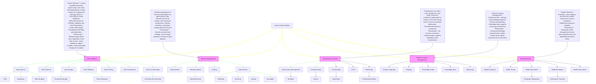

```mermaid
graph TD
    A[Domain Agent Pipeline] --> B[Data Collection]
    A --> C[Memory Management]
    A --> D[Infrastructure as Code]
    A --> E[Domain Context Management]
    A --> F[Model Selection]

    %% Data Collection Subcomponents
    B --> B1[Data Sources]
    B --> B2[Data Cleaning]
    B --> B3[Data Storage]
    B --> B4[Data Validation]
    B --> B5[Data Profiling]
    B --> B6[Data Visualization]
    B --> B7[Data Transformation]
    B1 --> B1a[APIs]
    B1 --> B1b[Databases]
    B1 --> B1c[Web Scraping]
    B3 --> B3a[Structured Storage]
    B3 --> B3b[Vector Database]
    B7 --> B7a[Unstructured Conversion]

    %% Memory Management Subcomponents
    C --> C1[Data Isolation]
    C --> C2[Storage Systems]
    C --> C3[Caching]
    C --> C4[Data Policies]
    C2 --> C2a[Milvus/Pinecone]
    C4 --> C4a[Retention]
    C4 --> C4b[Archiving]
    C4 --> C4c[Backup]
    C4 --> C4d[Encryption]

    %% Infrastructure as Code Subcomponents
    D --> D1[Infrastructure Management]
    D --> D2[Containerization]
    D --> D3[Orchestration]
    D --> D4[CI/CD]
    D --> D5[Monitoring]
    D1 --> D1a[Terraform]
    D2 --> D2a[Docker]
    D3 --> D3a[Kubernetes]
    D5 --> D5a[Prometheus/Grafana]

    %% Domain Context Management Subcomponents
    E --> E1[Domain Language]
    E --> E2[Ontology]
    E --> E3[Knowledge Graph]
    E --> E4[Knowledge Base]
    E --> E5[Reasoning]

    %% Model Selection Subcomponents
    F --> F1[Model Evaluation]
    F --> F2[Model Tuning]
    F --> F3[Model Deployment]
    F --> F4[Model Monitoring]
    F --> F5[Model Governance]
    F3 --> F3a[Production Deployment]
    F4 --> F4a[Performance Tracking]

    %% Linking High-Level to Low-Level
    linkStyle 0,1,2,3,4 stroke:#ff3,stroke-width:2px;
    linkStyle 5,6,7,8,9,10,11 stroke:#3f3,stroke-width:1px;
    linkStyle 12,13,14 stroke:#3f3,stroke-width:1px;
    linkStyle 15,16,17,18,19 stroke:#3f3,stroke-width:1px;
    linkStyle 20,21,22,23,24 stroke:#3f3,stroke-width:1px;
    linkStyle 25,26,27,28 stroke:#3f3,stroke-width:1px;

    %% Notes and Explanations
    classDef note fill:#f9f,stroke:#333,stroke-width:1px;
    B:::note
    noteB["
        **Data Collection**: Central to gathering domain-specific data. Uses tools like BeautifulSoup, Scrapy, Pandas for scraping and cleaning. Stores in CSV/JSON or vector databases (Milvus/Pinecone) for flexibility. Validation with Great Expectations ensures data quality. Visualization with Plotly aids exploration.
        **Reasoning**: Modular design allows easy integration of new data sources. Vector databases support scalable, unstructured data storage for AI models.
    "] --> B
    C:::note
    noteC["
        **Memory Management**: Ensures data isolation for agent-specific data. Milvus/Pinecone for storage, with caching for performance. Policies (retention, encryption) manage lifecycle securely.
        **Reasoning**: Isolation prevents data leakage; vector storage optimizes retrieval for large datasets.
    "] --> C
    D:::note
    noteD["
        **Infrastructure as Code**: Uses Terraform for infra setup, Docker for containers, Kubernetes for scaling. CI/CD with GitHub Actions ensures automated deployment. Prometheus/Grafana for monitoring.
        **Reasoning**: IaC ensures consistency; containerization supports portability across environments.
    "] --> D
    E:::note
    noteE["
        **Domain Context Management**: Implements DSL, ontology, and knowledge graphs for domain understanding. Knowledge base supports reasoning and inference.
        **Reasoning**: Structured knowledge representation enables context-aware agents, extensible for new domains.
    "] --> E
    F:::note
    noteF["
        **Model Selection**: Evaluates, tunes, deploys, and monitors models. Governance ensures compliance. Rollback/versioning for reliability.
        **Reasoning**: Systematic model management ensures optimal performance and adaptability to domain needs.
    "] --> F
```