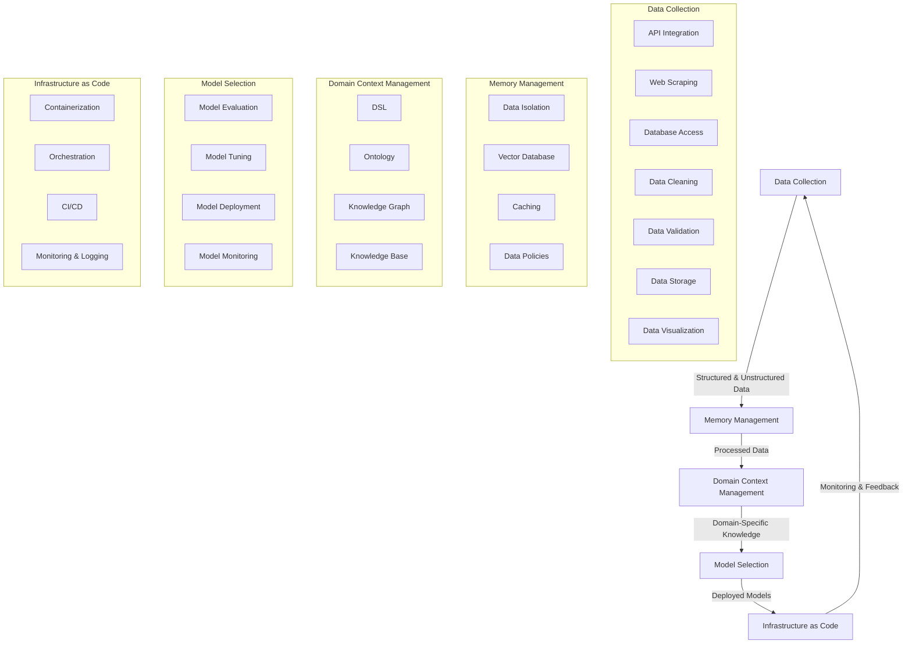

```mermaid
graph TD
    A[Data Collection] -->|Structured & Unstructured Data| B[Memory Management]
    B -->|Processed Data| C[Domain Context Management]
    C -->|Domain-Specific Knowledge| D[Model Selection]
    D -->|Deployed Models| E[Infrastructure as Code]
    E -->|Monitoring & Feedback| A

    subgraph Data Collection
        A1[API Integration]
        A2[Web Scraping]
        A3[Database Access]
        A4[Data Cleaning]
        A5[Data Validation]
        A6[Data Storage]
        A7[Data Visualization]
    end

    subgraph Memory Management
        B1[Data Isolation]
        B2[Vector Database]
        B3[Caching]
        B4[Data Policies]
    end

    subgraph Domain Context Management
        C1[DSL]
        C2[Ontology]
        C3[Knowledge Graph]
        C4[Knowledge Base]
    end

    subgraph Model Selection
        D1[Model Evaluation]
        D2[Model Tuning]
        D3[Model Deployment]
        D4[Model Monitoring]
    end

    subgraph Infrastructure as Code
        E1[Containerization]
        E2[Orchestration]
        E3[CI/CD]
        E4[Monitoring & Logging]
    end
```