# Milvus Cluster Implementation

This document provides a comprehensive overview of a Milvus cluster implementation using Docker Compose. It includes details about Milvus and its dependencies, a network diagram, testing procedures, best practices, and definitions for technical terms.

## Table of Contents

- [Overview](#overview)
- [Component Breakdown](#component-breakdown)
  - [Milvus](#milvus)
  - [etcd](#etcd)
  - [MinIO](#minio)
  - [Grafana](#grafana)
  - [Prometheus](#prometheus)
  - [Pulsar](#pulsar)
  - [HAProxy](#haproxy)
  - [Why Cluster Implementation](#why-cluster-implementation)
- [Milvus Cluster Architecture Diagram](#milvus-cluster-architectural-diagram)
- [Testing the Milvus Cluster](#testing-the-milvus-cluster)
  - [Test 1: Verify Milvus Proxy Health](#test-1-verify-milvus-proxy-health)
  - [Test 2: Connect to Milvus GUI](#test-2-connect-to-milvus-gui)
  - [Test 3: Create a Collection](#test-3-create-a-collection)
  - [Test 4: Insert Vectors](#test-4-insert-vectors)
  - [Test 5: Search Vectors](#test-5-search-vectors)
  - [Test 6: Verify etcd Cluster Health](#test-6-verify-etcd-cluster-health)
  - [Test 7: Check MinIO Health](#test-7-check-minio-health)
  - [Test 8: Validate Pulsar Cluster](#test-8-validate-pulsar-cluster)
  - [Test 9: Monitor Metrics with Prometheus](#test-9-monitor-metrics-with-prometheus)
  - [Test 10: Visualize Metrics in Grafana](#test-10-visualize-metrics-in-grafana)
- [Best Practices](#best-practices)
- [Definitions](#definitions)
- [Conclusion](#conclusion)

## Overview

The Milvus cluster implementation is a distributed vector database system designed for high-performance similarity search and analytics on large-scale vector data. It leverages Docker Compose to orchestrate multiple services, including Milvus, etcd, MinIO, Pulsar, HAProxy, Prometheus, and Grafana, ensuring scalability, reliability, and observability. This setup is ideal for applications requiring efficient management of high-dimensional data, such as image recognition, recommendation systems, and natural language processing.

## Component Breakdown

### Milvus

**Description**: Milvus is an open-source vector database designed for storing, indexing, and searching high-dimensional vectors. It supports similarity search and analytics, making it suitable for AI-driven applications.

**Use Case**: Milvus is used in scenarios requiring fast similarity search, such as image or video retrieval, recommendation systems, and semantic search in NLP.

**Pros**:
- High performance for vector similarity search.
- Supports multiple index types (e.g., IVF, HNSW).
- Scalable with distributed architecture.

**Cons**:
- Complex setup for distributed clusters.
- Requires tuning for optimal performance.
- Dependency on external storage and messaging systems.

**Cluster Rationale**: A cluster implementation enhances Milvus’s scalability and fault tolerance, distributing workloads across multiple nodes (e.g., query nodes, index nodes) to handle large datasets and high query rates.

### etcd

**Description**: etcd is a distributed key-value store used for storing metadata and configuration data in distributed systems. It ensures consistency and reliability through a consensus protocol.

**Use Case**: In this setup, etcd stores Milvus’s metadata, such as collection schemas and partition information.

**Pros**:
- Strong consistency guarantees.
- High availability with clustering.
- Simple API for key-value operations.

**Cons**:
- Resource-intensive for large clusters.
- Requires careful monitoring to prevent bottlenecks.
- Setup complexity for secure configurations.

**Cluster Rationale**: A three-node etcd cluster ensures high availability and fault tolerance, critical for maintaining Milvus metadata integrity in production environments.

### MinIO

**Description**: MinIO is an S3-compatible object storage system designed for high-performance data storage. It supports distributed deployments for scalability.

**Use Case**: MinIO stores Milvus’s vector data and indexes, providing persistent storage for large datasets.

**Pros**:
- S3 compatibility simplifies integration.
- High throughput for large-scale data.
- Distributed mode enhances reliability.

**Cons**:
- Requires significant disk space for large datasets.
- Configuration complexity for distributed setups.
- Monitoring needed to ensure performance.

**Cluster Rationale**: A distributed MinIO cluster provides fault tolerance and load balancing, essential for handling Milvus’s large-scale vector storage needs.

### Grafana

**Description**: Grafana is an open-source platform for visualizing and analyzing metrics through dashboards. It integrates with data sources like Prometheus.

**Use Case**: Grafana visualizes metrics from Milvus, etcd, MinIO, and Pulsar, aiding in performance monitoring and troubleshooting.

**Pros**:
- Customizable dashboards for real-time insights.
- Supports multiple data sources.
- User-friendly interface.

**Cons**:
- Requires setup of data sources and dashboards.
- Resource usage increases with complex queries.
- Learning curve for advanced features.

**Cluster Rationale**: Grafana’s integration with Prometheus in a cluster ensures centralized monitoring, critical for managing a distributed system’s health.

### Prometheus

**Description**: Prometheus is an open-source monitoring system for collecting and querying time-series metrics. It uses a pull-based model to scrape metrics from services.

**Use Case**: Prometheus collects metrics from Milvus, etcd, MinIO, and Pulsar, enabling performance analysis and alerting.

**Pros**:
- Efficient time-series data storage.
- Powerful query language (PromQL).
- Scalable with federation.

**Cons**:
- High memory usage for large datasets.
- Requires configuration for long-term storage.
- Alerting setup can be complex.

**Cluster Rationale**: Prometheus ensures comprehensive monitoring of the cluster, enabling proactive issue detection in a distributed environment.

### Pulsar

**Description**: Apache Pulsar is a distributed messaging and streaming platform that supports pub-sub and queue-based messaging. It is designed for high throughput and low latency.

**Use Case**: Pulsar handles Milvus’s message queues for data ingestion and coordination between components.

**Pros**:
- High throughput and low latency.
- Scalable with a multi-layered architecture.
- Supports multi-tenancy.

**Cons**:
- Complex setup with ZooKeeper and BookKeeper.
- Resource-intensive for large clusters.
- Monitoring required for optimal performance.

**Cluster Rationale**: A Pulsar cluster with ZooKeeper, BookKeeper, brokers, and proxies ensures reliable messaging for Milvus’s distributed operations, supporting high-throughput data pipelines.

### HAProxy

**Description**: HAProxy is a high-performance load balancer that distributes traffic across multiple backend services. It supports TCP and HTTP protocols.

**Use Case**: HAProxy routes traffic to etcd, MinIO, and Pulsar, ensuring load balancing and fault tolerance.

**Pros**:
- High performance and reliability.
- Flexible configuration for routing.
- Supports health checks for backend services.

**Cons**:
- Configuration complexity for advanced setups.
- Single point of failure if not clustered.
- Requires monitoring to prevent overload.

**Cluster Rationale**: HAProxy simplifies access to distributed services, enhancing reliability and performance in the Milvus cluster.

### Why Cluster Implementation

A cluster implementation is optimal for this setup because:
- **Scalability**: Distributes workloads across multiple nodes, handling large datasets and high query volumes.
- **Fault Tolerance**: Redundant nodes (e.g., three-node etcd, MinIO, Pulsar) ensure continuity during failures.
- **Performance**: Load balancing via HAProxy and distributed processing in Milvus and Pulsar improve throughput.
- **Observability**: Prometheus and Grafana provide centralized monitoring, critical for managing complex systems.
- **Reliability**: Persistent storage (MinIO) and consistent metadata (etcd) ensure data integrity.

This approach is ideal for production environments requiring robust, scalable vector search capabilities.

## Milvus Cluster Architectural Diagram

The following `Milvus Cluster Diagram` illustrates the Milvus cluster architecture, showing interactions between components and network boundaries.

```mermaid
%%{
  init: {
    'theme': 'dark',
    'themeVariables': {
      'primaryColor': '#00ff00',
      'edgeLabelBackground': '#333',
      'lineColor': '#ff00ff',
      'tertiaryColor': '#00ffff',
      'fontSize': '16px'
    }
  }
}%%
graph TB
    %% Service Layers
    subgraph External_Entry["External Entry"]
        direction TB
        HAProxy["HAProxy<br>Entry Point<br>Ports: 2379, 9000, 9001, 19530, 9090, 3000, 3300, 6650, 8080"]
        style HAProxy fill:#1505a8,stroke:#ff00ff,stroke-width:2px,color:#fff
    end

    subgraph Milvus_Components["Milvus Components"]
        direction TB
        MilvusEntrypoint["milvus-entrypoint<br>HAProxy"]
        MilvusProxy["milvus-proxy"]
        MilvusGUI["milvus-gui<br>Client Interface"]
        RootCoord["rootcoord<br>Metadata Manager"]
        QueryCoord["querycoord<br>Query Coordinator"]
        QueryNode1["querynode-1"]
        QueryNode2["querynode-2"]
        QueryNode3["querynode-3"]
        IndexCoord["indexcoord<br>Index Coordinator"]
        IndexNode1["indexnode-1"]
        IndexNode2["indexnode-2"]
        IndexNode3["indexnode-3"]
        DataCoord["datacoord<br>Data Coordinator"]
        DataNode1["datanode-1"]
        DataNode2["datanode-2"]
        DataNode3["datanode-3"]
        style MilvusEntrypoint fill:#1505a8,stroke:#ff00ff,stroke-width:2px,color:#fff
        style MilvusProxy fill:#00ffff,stroke:#ff00ff,stroke-width:2px,color:#000
        style MilvusGUI fill:#71f74f,stroke:#ff00ff,stroke-width:2px,color:#000
        style RootCoord fill:#00ffff,stroke:#ff00ff,stroke-width:2px,color:#000
        style QueryCoord fill:#00ffff,stroke:#ff00ff,stroke-width:2px,color:#000
        style IndexCoord fill:#00ffff,stroke:#ff00ff,stroke-width:2px,color:#000
        style DataCoord fill:#00ffff,stroke:#ff00ff,stroke-width:2px,color:#000
    end

    subgraph Etcd_Cluster["Etcd Cluster"]
        direction TB
        EtcdProxy["etcd-proxy<br>HAProxy"]
        Etcd0["etcd0"]
        Etcd1["etcd1"]
        Etcd2["etcd2"]
        style EtcdProxy fill:#1505a8,stroke:#ff00ff,stroke-width:2px,color:#fff
        style Etcd0 fill:#000000,stroke:#00ffff,stroke-width:2px,color:#fff
        style Etcd1 fill:#000000,stroke:#00ffff,stroke-width:2px,color:#fff
        style Etcd2 fill:#000000,stroke:#00ffff,stroke-width:2px,color:#fff
    end

    subgraph Minio_Cluster["MinIO Cluster"]
        direction TB
        MinioProxy["minio-proxy<br>HAProxy"]
        Minio0["minio0"]
        Minio1["minio1"]
        Minio2["minio2"]
        style MinioProxy fill:#1505a8,stroke:#ff00ff,stroke-width:2px,color:#fff
        style Minio0 fill:#000000,stroke:#00ffff,stroke-width:2px,color:#fff
        style Minio1 fill:#000000,stroke:#00ffff,stroke-width:2px,color:#fff
        style Minio2 fill:#000000,stroke:#00ffff,stroke-width:2px,color:#fff
    end

    subgraph Pulsar_Cluster["Pulsar Cluster"]
        direction TB
        PulsarProxy["pulsar-proxy<br>HAProxy"]
        Proxy1["proxy1"]
        Proxy2["proxy2"]
        Proxy3["proxy3"]
        Broker1["broker1"]
        Broker2["broker2"]
        Broker3["broker3"]
        Bookie1["bookie1"]
        Bookie2["bookie2"]
        Bookie3["bookie3"]
        Zookeeper1["zookeeper1"]
        Zookeeper2["zookeeper2"]
        Zookeeper3["zookeeper3"]
        PulsarInit["pulsar-init<br>Cluster Initializer"]
        style PulsarProxy fill:#1505a8,stroke:#ff00ff,stroke-width:2px,color:#fff
        style Proxy1 fill:#00ffff,stroke:#ff00ff,stroke-width:2px,color:#000
        style Proxy2 fill:#00ffff,stroke:#ff00ff,stroke-width:2px,color:#000
        style Proxy3 fill:#00ffff,stroke:#ff00ff,stroke-width:2px,color:#000
    end

    subgraph Monitoring["Monitoring"]
        direction TB
        Prometheus["prometheus"]
        Grafana["grafana"]
        NodeExporter["node_exporter"]
        style Prometheus fill:#00ffff,stroke:#ff00ff,stroke-width:2px,color:#000
        style Grafana fill:#00ffff,stroke:#ff00ff,stroke-width:2px,color:#000
        style NodeExporter fill:#00ffff,stroke:#ff00ff,stroke-width:2px,color:#000
    end

    %% Volume Mounts Layer
    subgraph Volumes["Persistent Volumes"]
        direction TB
        HaproxyData["haproxy_data"]
        Etcd0Data["etcd0_data"]
        Etcd1Data["etcd1_data"]
        Etcd2Data["etcd2_data"]
        MinioData0["minio_data0"]
        MinioData1["minio_data1"]
        MinioData2["minio_data2"]
        ZookeeperData1["zookeeper_data1"]
        ZookeeperData2["zookeeper_data2"]
        ZookeeperData3["zookeeper_data3"]
        BookkeeperData1["bookkeeper_data1"]
        BookkeeperData2["bookkeeper_data2"]
        BookkeeperData3["bookkeeper_data3"]
        PrometheusData["prometheus_data"]
        GrafanaData["grafana_data"]
        style HaproxyData fill:#ffffff,stroke:#00ff00,stroke-width:2px,color:#000
        style Etcd0Data fill:#ffffff,stroke:#00ff00,stroke-width:2px,color:#000
        style Etcd1Data fill:#ffffff,stroke:#00ff00,stroke-width:2px,color:#000
        style Etcd2Data fill:#ffffff,stroke:#00ff00,stroke-width:2px,color:#000
        style MinioData0 fill:#ffffff,stroke:#00ff00,stroke-width:2px,color:#000
        style MinioData1 fill:#ffffff,stroke:#00ff00,stroke-width:2px,color:#000
        style MinioData2 fill:#ffffff,stroke:#00ff00,stroke-width:2px,color:#000
        style ZookeeperData1 fill:#ffffff,stroke:#00ff00,stroke-width:2px,color:#000
        style ZookeeperData2 fill:#ffffff,stroke:#00ff00,stroke-width:2px,color:#000
        style ZookeeperData3 fill:#ffffff,stroke:#00ff00,stroke-width:2px,color:#000
        style BookkeeperData1 fill:#ffffff,stroke:#00ff00,stroke-width:2px,color:#000
        style BookkeeperData2 fill:#ffffff,stroke:#00ff00,stroke-width:2px,color:#000
        style BookkeeperData3 fill:#ffffff,stroke:#00ff00,stroke-width:2px,color:#000
        style PrometheusData fill:#ffffff,stroke:#00ff00,stroke-width:2px,color:#000
        style GrafanaData fill:#ffffff,stroke:#00ff00,stroke-width:2px,color:#000
    end

    %% Dependency Relationships
    %% External Entry
    HAProxy --> MilvusEntrypoint
    HAProxy --> MilvusGUI
    HAProxy --> EtcdProxy
    HAProxy --> MinioProxy
    HAProxy --> PulsarProxy
    HAProxy --> Prometheus
    HAProxy --> Grafana

    %% Milvus Dependencies
    MilvusGUI --> MilvusEntrypoint
    MilvusEntrypoint --> MilvusProxy
    MilvusProxy --> RootCoord
    MilvusProxy --> QueryCoord
    MilvusProxy --> IndexCoord
    MilvusProxy --> DataCoord
    RootCoord --> EtcdProxy
    RootCoord --> MinioProxy
    RootCoord --> PulsarProxy
    QueryCoord --> RootCoord
    QueryCoord --> EtcdProxy
    QueryCoord --> MinioProxy
    QueryCoord --> PulsarProxy
    QueryNode1 --> QueryCoord
    QueryNode2 --> QueryCoord
    QueryNode3 --> QueryCoord
    IndexCoord --> RootCoord
    IndexCoord --> EtcdProxy
    IndexCoord --> MinioProxy
    IndexCoord --> PulsarProxy
    IndexNode1 --> IndexCoord
    IndexNode2 --> IndexCoord
    IndexNode3 --> IndexCoord
    DataCoord --> RootCoord
    DataCoord --> EtcdProxy
    DataCoord --> MinioProxy
    DataCoord --> PulsarProxy
    DataNode1 --> DataCoord
    DataNode2 --> DataCoord
    DataNode3 --> DataCoord

    %% Etcd Dependencies
    EtcdProxy --> Etcd0
    EtcdProxy --> Etcd1
    EtcdProxy --> Etcd2
    Etcd0 --> Etcd1
    Etcd0 --> Etcd2
    Etcd1 --> Etcd0
    Etcd1 --> Etcd2
    Etcd2 --> Etcd0
    Etcd2 --> Etcd1

    %% MinIO Dependencies
    MinioProxy --> Minio0
    MinioProxy --> Minio1
    MinioProxy --> Minio2

    %% Pulsar Dependencies
    PulsarProxy --> Proxy1
    PulsarProxy --> Proxy2
    PulsarProxy --> Proxy3
    Proxy1 --> Broker1
    Proxy2 --> Broker2
    Proxy3 --> Broker3
    Broker1 --> Bookie1
    Broker2 --> Bookie2
    Broker3 --> Bookie3
    Bookie1 --> Zookeeper1
    Bookie2 --> Zookeeper2
    Bookie3 --> Zookeeper3
    Zookeeper1 --> Zookeeper2
    Zookeeper2 --> Zookeeper3
    Zookeeper3 --> Zookeeper1
    PulsarInit --> Zookeeper1
    PulsarInit --> Zookeeper2
    PulsarInit --> Zookeeper3

    %% Monitoring Dependencies
    Grafana --> Prometheus
    Prometheus --> NodeExporter
    Prometheus --> HAProxy
    Prometheus --> EtcdProxy
    Prometheus --> MinioProxy
    Prometheus --> PulsarProxy
    Prometheus --> MilvusProxy

    %% Volume Dependencies
    HAProxy --> HaproxyData
    Etcd0 --> Etcd0Data
    Etcd1 --> Etcd1Data
    Etcd2 --> Etcd2Data
    Minio0 --> MinioData0
    Minio1 --> MinioData1
    Minio2 --> MinioData2
    Zookeeper1 --> ZookeeperData1
    Zookeeper2 --> ZookeeperData2
    Zookeeper3 --> ZookeeperData3
    Bookie1 --> BookkeeperData1
    Bookie2 --> BookkeeperData2
    Bookie3 --> BookkeeperData3
    Prometheus --> PrometheusData
    Grafana --> GrafanaData

    %% Notes
    classDef note fill:#333,stroke:#00ff00,stroke-width:2px,color:#fff
    Note1["Note: HAProxy routes client traffic to Milvus, Etcd, MinIO, Pulsar, and monitoring services."] --> HAProxy:::note
    Note2["Note: Milvus proxy depends on coordinators (rootcoord, querycoord, etc.) for query routing and metadata management."] --> MilvusProxy:::note
    Note3["Note: Milvus coordinators depend on Etcd (metadata), MinIO (storage), and Pulsar (messaging)."] --> RootCoord:::note
    Note4["Note: Persistent volumes ensure data durability for Etcd, MinIO, Pulsar, Prometheus, and Grafana."] --> Volumes:::note
    Note5["Note: Prometheus scrapes metrics from all services, enabling Grafana visualizations."] --> Prometheus:::note
```



## Testing the Milvus Cluster

Below are 10 well-documented tests and examples to verify the Milvus cluster’s functionality. These tests assume the cluster is running via Docker Compose.

### Test 1: Verify Milvus Proxy Health
**Purpose**: Ensure the Milvus proxy is running and healthy.
**Command**:
```bash
curl -f http://localhost:9091/healthz
```
**Expected Output**: HTTP 200 OK response.
**Notes**: Run this on the host machine. A failure indicates issues with the proxy or dependencies.

### Test 2: Connect to Milvus GUI
**Purpose**: Verify the Milvus GUI is accessible.
**Steps**:
1. Open a browser and navigate to `http://localhost:3300`.
2. Log in with default credentials (if unchanged).
**Expected Output**: Milvus GUI dashboard loads.
**Notes**: Ensure the proxy is healthy before testing.

### Test 3: Create a Collection
**Purpose**: Test collection creation in Milvus.
**Code** (Python using `pymilvus`):
```python
from pymilvus import connections, Collection, FieldSchema, CollectionSchema, DataType

connections.connect(host='localhost', port='19530')
fields = [
    FieldSchema(name="id", dtype=DataType.INT64, is_primary=True),
    FieldSchema(name="embedding", dtype=DataType.FLOAT_VECTOR, dim=8)
]
schema = CollectionSchema(fields, description="Test collection")
collection = Collection("test_collection", schema)
```
**Expected Output**: Collection created successfully.
**Notes**: Install `pymilvus` via `pip install pymilvus`.

### Test 4: Insert Vectors
**Purpose**: Test vector insertion into a collection.
**Code** (Python):
```python
import numpy as np
from pymilvus import Collection

collection = Collection("test_collection")
data = [
    [i for i in range(10)],  # IDs
    [np.random.rand(8).tolist() for _ in range(10)]  # Vectors
]
collection.insert(data)
```
**Expected Output**: Vectors inserted successfully.
**Notes**: Ensure the collection exists.

### Test 5: Search Vectors
**Purpose**: Test vector similarity search.
**Code** (Python):
```python
from pymilvus import Collection

collection = Collection("test_collection")
collection.load()
query_vectors = [np.random.rand(8).tolist()]
results = collection.search(
    data=query_vectors,
    anns_field="embedding",
    param={"metric_type": "L2", "params": {"nprobe": 10}},
    limit=5
)
print(results)
```
**Expected Output**: List of closest vectors with distances.
**Notes**: Adjust `metric_type` based on use case.

### Test 6: Verify etcd Cluster Health
**Purpose**: Ensure the etcd cluster is operational.
**Command**:
```bash
docker exec etcd0 etcdctl --endpoints=http://etcd0:2379,http://etcd1:2379,http://etcd2:2379 endpoint health
```
**Expected Output**: All endpoints report `healthy`.
**Notes**: Run from the host with Docker installed.

### Test 7: Check MinIO Health
**Purpose**: Verify MinIO cluster health.
**Command**:
```bash
curl -I http://localhost:9000/minio/health/live
```
**Expected Output**: HTTP 200 OK response.
**Notes**: Run on the host machine.

### Test 8: Validate Pulsar Cluster
**Purpose**: Ensure Pulsar cluster is functional.
**Command**:
```bash
docker exec pulsar-init pulsar-admin clusters list
```
**Expected Output**: Lists `cluster-a` as active.
**Notes**: Requires `pulsar-admin` installed in the container.

### Test 9: Monitor Metrics with Prometheus
**Purpose**: Verify Prometheus is collecting metrics.
**Steps**:
1. Open `http://localhost:9090` in a browser.
2. Query `milvus_proxy_request_total` in the Prometheus UI.
**Expected Output**: Displays request metrics for Milvus proxy.
**Notes**: Ensure Prometheus is running.

### Test 10: Visualize Metrics in Grafana
**Purpose**: Confirm Grafana displays cluster metrics.
**Steps**:
1. Navigate to `http://localhost:3000`.
2. Log in with `admin`/`WW91ckdyYWZhbmFTdHJvbmdQYXNzd29yZDEyMw`.
3. Add Prometheus as a data source (URL: `http://prometheus:9090`).
4. Create a dashboard for `milvus_proxy_request_total`.
**Expected Output**: Dashboard shows Milvus metrics.
**Notes**: Configure dashboards for specific metrics.

## Best Practices

1. **Secure Credentials**: Replace default passwords (e.g., MinIO, Grafana) with strong, unique values in production.
2. **Resource Allocation**: Adjust CPU and memory limits in Docker Compose based on workload and hardware capacity.
3. **Monitoring**: Configure Prometheus alerts for critical metrics (e.g., etcd latency, MinIO disk usage).
4. **Backups**: Regularly back up etcd snapshots and MinIO data to prevent data loss.
5. **Network Isolation**: Use internal networks for services (e.g., etcd, MinIO) to reduce exposure.
6. **Health Checks**: Enable and monitor health checks for all services to detect failures early.
7. **Logging**: Configure centralized logging for all services to simplify troubleshooting.
8. **Scaling**: Add nodes to Milvus query, index, or data layers as needed for performance.
9. **Documentation**: Maintain updated documentation for cluster configuration and procedures.
10. **Testing**: Regularly run the above tests to ensure cluster stability.

## Definitions

- **Vector Database**: A database optimized for storing and querying high-dimensional vectors, used in AI for similarity search.
- **Key-Value Store**: A simple database that stores data as key-value pairs, used for configuration and metadata.
- **Object Storage**: A storage system for unstructured data (e.g., files, images), optimized for scalability.
- **Pub-Sub Messaging**: A messaging pattern where publishers send messages to topics, and subscribers receive them.
- **Load Balancer**: A system that distributes network traffic across multiple servers to improve performance and reliability.
- **Time-Series Metrics**: Data points collected over time, used for monitoring system performance.
- **Cluster**: A group of servers working together to provide scalability and fault tolerance.
- **Docker Compose**: A tool for defining and running multi-container Docker applications.
- **Mermaid Diagram**: A text-based diagramming tool for creating flowcharts and architecture diagrams.
- **S3-Compatible**: A storage system that supports Amazon S3’s API for object storage.

## Conclusion

The Milvus cluster implementation provides a robust, scalable solution for vector similarity search, leveraging etcd, MinIO, Pulsar, HAProxy, Prometheus, and Grafana for metadata, storage, messaging, load balancing, and monitoring. The cluster architecture ensures high availability and performance, making it suitable for production-grade AI applications. By following the provided tests and best practices, one can maintain a reliable and efficient system. This setup exemplifies modern distributed systems design, balancing complexity with functionality.