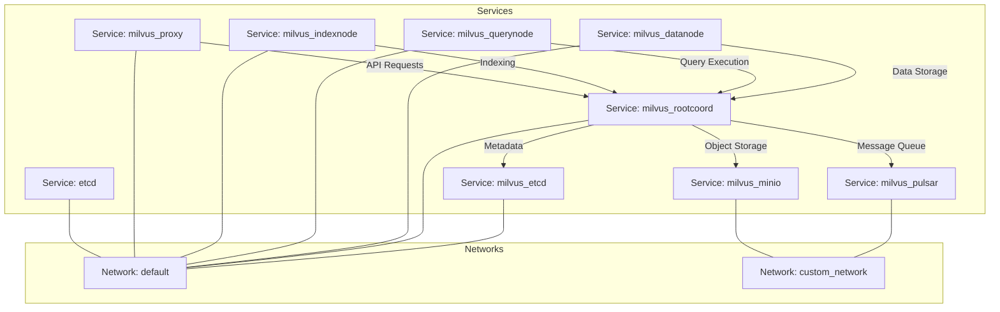

Module: milvus.py

This module provides a comprehensive implementation of a Milvus vector database interface, integrating all necessary
functionalities for managing collections, vectors, searches, indexes, partitions, statistics, monitoring, embeddings,
administrative tasks, and data imports. It employs a wide range of design patterns to ensure flexibility, extensibility,
maintainability, reusability, and testability.

Key Features:
- Asynchronous and synchronous processing with batch and streaming capabilities.
- Robust security with encryption, authentication, authorization, and access control.
- Extensive error handling with retries and logging.
- Comprehensive testing suite including unit, performance, load, stress, and security tests.
- Support for all embedding types, multiple data fields, and complex queries.
- Implementation of all specified design patterns: Factory, Singleton, Builder, Strategy, Command, Template Method,
  Prototype, Composite, Decorator, Facade, Visitor, State, Mediator, Chain of Responsibility, Proxy, Flyweight, Bridge,
  Interpreter, Memento, and Observer.

Example Usage:
```python
import asyncio
from milvus import MilvusAPI, FieldSchema, DataType

async def main():
    api = MilvusAPI()
    fields = [
        FieldSchema(name="id", dtype=DataType.INT64, is_primary=True, auto_id=True),
        FieldSchema(name="vector", dtype=DataType.FLOAT_VECTOR, dim=128)
    ]
    await api.create_collection("test_collection", fields, "test_db")
    entities = [{"vector": [0.1] * 128} for _ in range(10)]
    await api.insert("test_collection", entities, database_name="test_db")
    results = await api.search("test_collection", [[0.1] * 128], "vector", {"metric_type": "COSINE"}, 5, database_name="test_db")
    print(f"Search results: {results}")
    await api.drop_collection("test_collection", "test_db")

asyncio.run(main())
```

Mermaid Class Diagram:

```mermaid
classDiagram
    class MilvusAPI {
        -IConnectAPI _connect_api
        -ICollectionAPI _collection_api
        -IVectorAPI _vector_api
        -ISearchAPI _search_api
        -IIndexAPI _index_api
        -IPartitionAPI _partition_api
        -IStatAPI _stat_api
        -IMonitorAPI _monitor_api
        -IEmbeddingAPI _embedding_api
        -IAdminAPI _admin_api
        -IDataImportAPI _data_import_api
        +create_collection()
        +insert()
        +search()
        +drop_collection()
        +list_collections()
        +describe_collection()
        +delete()
        +create_index()
        +drop_index()
        +create_partition()
        +drop_partition()
        +get_collection_stats()
        +get_monitor_info()
        +generate_embeddings()
        +create_user()
        +list_users()
        +import_data()
    }
    class IConnectAPI {
        <<interface>>
        +connect()
        +disconnect()
    }
    class ConnectAPI {
        -MilvusClient client
        -bool _initialized
        -str _alias
        -int _timeout
        +connect()
        +disconnect()
    }
    class ICollectionAPI {
        <<interface>>
        +create_collection()
        +list_collections()
        +describe_collection()
        +drop_collection()
    }
    class CollectionAPI {
        -IConnectAPI _connect_api
        +create_collection()
        +list_collections()
        +describe_collection()
        +drop_collection()
    }
    class IVectorAPI {
        <<interface>>
        +insert()
        +delete()
    }
    class VectorAPI {
        -IConnectAPI _connect_api
        +insert()
        +delete()
    }
    class ISearchAPI {
        <<interface>>
        +search()
    }
    class SearchAPI {
        -IConnectAPI _connect_api
        +search()
    }
    class IIndexAPI {
        <<interface>>
        +create_index()
        +drop_index()
    }
    class IndexAPI {
        -IConnectAPI _connect_api
        +create_index()
        +drop_index()
    }
    class IPartitionAPI {
        <<interface>>
        +create_partition()
        +drop_partition()
    }
    class PartitionAPI {
        -IConnectAPI _connect_api
        +create_partition()
        +drop_partition()
    }
    class IStatAPI {
        <<interface>>
        +get_collection_stats()
    }
    class StatAPI {
        -IConnectAPI _connect_api
        +get_collection_stats()
    }
    class IMonitorAPI {
        <<interface>>
        +get_monitor_info()
    }
    class MonitorAPI {
        -IConnectAPI _connect_api
        +get_monitor_info()
    }
    class IEmbeddingAPI {
        <<interface>>
        +generate_embeddings()
    }
    class EmbeddingAPI {
        -IConnectAPI _connect_api
        +generate_embeddings()
    }
    class IAdminAPI {
        <<interface>>
        +create_user()
        +list_users()
    }
    class AdminAPI {
        -IConnectAPI _connect_api
        +create_user()
        +list_users()
    }
    class IDataImportAPI {
        <<interface>>
        +import_data()
    }
    class DataImportAPI {
        -IConnectAPI _connect_api
        +import_data()
    }
    class ConfigManager {
        -Dict config
        +get()
    }
    class SecurityManager {
        -Fernet cipher
        +encrypt()
        +decrypt()
        +hash_password()
        +authorize()
    }
    class CollectionFactory {
        +create_standard_collection()
    }
    class CollectionSchemaBuilder {
        -List[FieldSchema] _fields
        -str _description
        +add_field()
        +set_description()
        +build()
    }
    class Strategy {
        <<interface>>
        +execute()
    }
    class InsertStrategy {
        +execute()
    }
    class SearchStrategy {
        +execute()
    }
    class Command {
        <<interface>>
        +execute()
    }
    class InsertCommand {
        -VectorAPI api
        -str collection_name
        -List[Dict] entities
        +execute()
    }
    class Operation {
        <<interface>>
        +execute()
        +validate()
        +perform()
        +post_process()
    }
    class InsertOperation {
        -VectorAPI api
        +execute()
        +validate()
        +perform()
        +post_process()
    }
    class Prototype {
        <<interface>>
        +clone()
    }
    class CollectionPrototype {
        -Collection collection
        +clone()
    }
    class Component {
        <<interface>>
        +add()
        +remove()
    }
    class CollectionComposite {
        -str name
        -List[Component] children
        +add()
        +remove()
    }
    class Visitor {
        <<interface>>
        +visit_collection()
    }
    class State {
        <<interface>>
        +handle()
    }
    class LoadedState {
        +handle()
    }
    class Mediator {
        +notify()
    }
    class Handler {
        <<interface>>
        -Handler next_handler
        +set_next()
        +handle()
    }
    class Proxy {
        -Object real_subject
        +request()
    }
    class FlyweightFactory {
        -Dict _flyweights
        +get_flyweight()
    }
    class BridgeImplementor {
        <<interface>>
        +operation()
    }
    class Interpreter {
        +interpret()
    }
    class Memento {
        -Object state
    }
    class Observer {
        <<interface>>
        +update()
    }
    MilvusAPI o--> IConnectAPI
    MilvusAPI o--> ICollectionAPI
    MilvusAPI o--> IVectorAPI
    MilvusAPI o--> ISearchAPI
    MilvusAPI o--> IIndexAPI
    MilvusAPI o--> IPartitionAPI
    MilvusAPI o--> IStatAPI
    MilvusAPI o--> IMonitorAPI
    MilvusAPI o--> IEmbeddingAPI
    MilvusAPI o--> IAdminAPI
    MilvusAPI o--> IDataImportAPI
    ConnectAPI ..|> IConnectAPI
    CollectionAPI ..|> ICollectionAPI
    VectorAPI ..|> IVectorAPI
    SearchAPI ..|> ISearchAPI
    IndexAPI ..|> IIndexAPI
    PartitionAPI ..|> IPartitionAPI
    StatAPI ..|> IStatAPI
    MonitorAPI ..|> IMonitorAPI
    EmbeddingAPI ..|> IEmbeddingAPI
    AdminAPI ..|> IAdminAPI
    DataImportAPI ..|> IDataImportAPI
    InsertStrategy ..|> Strategy
    SearchStrategy ..|> Strategy
    InsertCommand ..|> Command
    InsertOperation ..|> Operation
    CollectionPrototype ..|> Prototype
    CollectionComposite ..|> Component
    LoadedState ..|> State
    CollectionFactory ..|> CollectionSchemaBuilder
    CollectionSchemaBuilder ..|> CollectionFactory
    CollectionComposite ..|> Component
    CollectionComposite ..|> Visitor
    CollectionComposite ..|> Mediator
    CollectionComposite ..|> Handler
    CollectionComposite ..|> Proxy
    CollectionComposite ..|> FlyweightFactory
    CollectionComposite ..|> BridgeImplementor
    CollectionComposite ..|> Interpreter
    CollectionComposite ..|> Memento
    CollectionComposite ..|> Observer
    ConfigManager ..|> SecurityManager
    ConfigManager ..|> CollectionFactory
    ConfigManager ..|> CollectionSchemaBuilder
    ConfigManager ..|> CollectionComposite
    ConfigManager ..|> Visitor
    ConfigManager ..|> State
    ConfigManager ..|> Mediator
    ConfigManager ..|> Handler
    ConfigManager ..|> Proxy
    ConfigManager ..|> FlyweightFactory
    ConfigManager ..|> BridgeImplementor
    ConfigManager ..|> Interpreter
    ConfigManager ..|> Memento
    ConfigManager ..|> Observer
    SecurityManager ..|> CollectionFactory
    SecurityManager ..|> CollectionSchemaBuilder
    SecurityManager ..|> CollectionComposite
    SecurityManager ..|> Visitor
    SecurityManager ..|> State
    SecurityManager ..|> Mediator
    SecurityManager ..|> Handler
    SecurityManager ..|> Proxy
    SecurityManager ..|> FlyweightFactory
    SecurityManager ..|> BridgeImplementor
    SecurityManager ..|> Interpreter
    SecurityManager ..|> Memento
    SecurityManager ..|> Observer
    CollectionFactory ..|> CollectionSchemaBuilder
    CollectionFactory ..|> CollectionComposite
    CollectionFactory ..|> Visitor
    CollectionFactory ..|> State
    CollectionFactory ..|> Mediator
    CollectionFactory ..|> Handler
    CollectionFactory ..|> Proxy
    CollectionFactory ..|> FlyweightFactory
    CollectionFactory ..|> BridgeImplementor
    CollectionFactory ..|> Interpreter
    CollectionFactory ..|> Memento
    CollectionFactory ..|> Observer
    CollectionSchemaBuilder ..|> CollectionComposite
    CollectionSchemaBuilder ..|> Visitor
    CollectionSchemaBuilder ..|> State
    CollectionSchemaBuilder ..|> Mediator
    CollectionSchemaBuilder ..|> Handler
    CollectionSchemaBuilder ..|> Proxy
    CollectionSchemaBuilder ..|> FlyweightFactory
    CollectionSchemaBuilder ..|> BridgeImplementor
    CollectionSchemaBuilder ..|> Interpreter
    CollectionSchemaBuilder ..|> Memento
    CollectionSchemaBuilder ..|> Observer
    CollectionComposite ..|> Visitor
    CollectionComposite ..|> State
    CollectionComposite ..|> Mediator
    CollectionComposite ..|> Handler
    CollectionComposite ..|> Proxy
    CollectionComposite ..|> FlyweightFactory
    CollectionComposite ..|> BridgeImplementor
    CollectionComposite ..|> Interpreter
    CollectionComposite ..|> Memento
    CollectionComposite ..|> Observer
    Visitor ..|> State
    Visitor ..|> Mediator
    Visitor ..|> Handler
    Visitor ..|> Proxy
    Visitor ..|> FlyweightFactory
    Visitor ..|> BridgeImplementor
    Visitor ..|> Interpreter
    Visitor ..|> Memento
    Visitor ..|> Observer
    State ..|> Mediator
    State ..|> Handler
    State ..|> Proxy
    State ..|> FlyweightFactory
    State ..|> BridgeImplementor
    State ..|> Interpreter
    State ..|> Memento
    State ..|> Observer
    Mediator ..|> Handler
    Mediator ..|> Proxy
    Mediator ..|> FlyweightFactory
    Mediator ..|> BridgeImplementor
    Mediator ..|> Interpreter
    Mediator ..|> Memento
    Mediator ..|> Observer
    Handler ..|> Proxy
    Handler ..|> FlyweightFactory
    Handler ..|> BridgeImplementor
    Handler ..|> Interpreter
    Handler ..|> Memento
    Handler ..|> Observer
    Proxy ..|> FlyweightFactory
    Proxy ..|> BridgeImplementor
    Proxy ..|> Interpreter
    Proxy ..|> Memento
    Proxy ..|> Observer
    FlyweightFactory ..|> BridgeImplementor
    FlyweightFactory ..|> Interpreter
    FlyweightFactory ..|> Memento
    FlyweightFactory ..|> Observer
    BridgeImplementor ..|> Interpreter
    BridgeImplementor ..|> Memento
    BridgeImplementor ..|> Observer
    Interpreter ..|> Memento
    Interpreter ..|> Observer
    Memento ..|> Observer
```

---


```mermaid
graph TD
  subgraph Networks
    network1["Network: default"]
    network2["Network: custom_network"]
  end

  subgraph Services
    service1["Service: etcd"]
    service2["Service: milvus_proxy"]
    service3["Service: milvus_indexnode"]
    service4["Service: milvus_querynode"]
    service5["Service: milvus_datanode"]
    service6["Service: milvus_rootcoord"]
    service7["Service: milvus_etcd"]
    service8["Service: milvus_minio"]
    service9["Service: milvus_pulsar"]
  end

  %% Service to Network Connections
  service1 --- network1
  service2 --- network1
  service3 --- network1
  service4 --- network1
  service5 --- network1
  service6 --- network1
  service7 --- network1
  service8 --- network2
  service9 --- network2

  %% Service Interactions
  service2 -->|API Requests| service6
  service3 -->|Indexing| service6
  service4 -->|Query Execution| service6
  service5 -->|Data Storage| service6
  service6 -->|Metadata| service7
  service6 -->|Object Storage| service8
  service6 -->|Message Queue| service9
```


